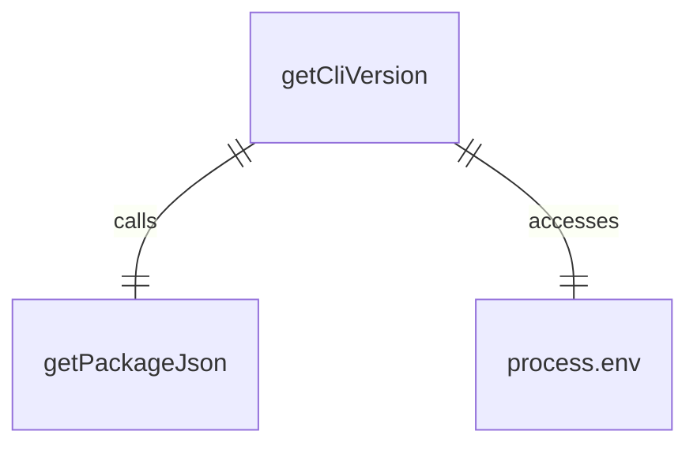
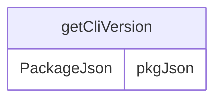

# version.ts

这个文件提供了一个异步函数来获取CLI应用程序的版本信息。

## 功能概述

1. 异步获取CLI版本号
2. 支持多种版本来源
3. 提供默认版本值

## 函数结构

### getCliVersion
- 异步函数，返回Promise<string>
- 优先级顺序获取版本信息：
  1. 环境变量CLI_VERSION
  2. package.json中的version字段
  3. 默认值'unknown'
- 使用getPackageJson函数获取package.json内容

## 版本来源优先级

### 环境变量
- CLI_VERSION环境变量
- 最高优先级，用于覆盖默认版本

### Package.json
- 从package.json文件中读取version字段
- 通过getPackageJson函数获取

### 默认值
- 当无法获取版本信息时返回'unknown'

## 依赖关系

- 依赖 `./package.js` 的 `getPackageJson` 函数
- 依赖Node.js的 `process.env` 访问环境变量

## 函数级调用关系

## 变量级调用关系

