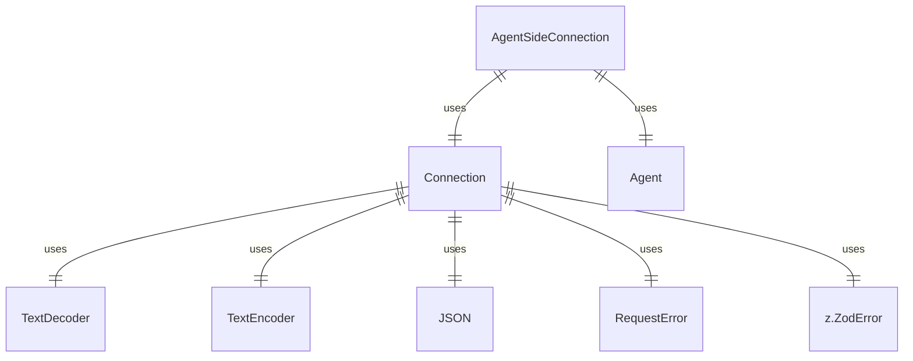

# acp.ts

这个文件定义了一个简单的JSON-RPC协议，用于GUI应用程序与代理之间的交互。

## 功能概述

1. 定义客户端和代理的接口
2. 实现代理端的连接处理
3. 处理JSON-RPC消息的发送和接收
4. 提供错误处理机制

## 类和接口结构

### AgentSideConnection
- 实现代理端的连接处理
- 构造函数接收代理工厂函数、输入流和输出流
- 处理来自客户端的请求并调用相应的代理方法
- 提供向客户端发送通知和请求的方法

### Connection
- 处理JSON-RPC消息的发送和接收
- 维护待处理的响应映射
- 处理传入的消息并调用相应的方法处理器
- 提供发送请求和通知的方法

### RequestError
- 定义JSON-RPC错误类型
- 提供各种标准错误的静态构造方法
- 提供将错误转换为响应结果的方法

### Client
- 定义客户端接口
- 包含请求权限、会话更新、读写文件等方法

### Agent
- 定义代理接口
- 包含初始化、新建会话、加载会话、认证、提示和取消等方法

## 依赖关系

- 依赖 `zod` 进行数据验证
- 依赖 `node:os` 获取行结束符
- 依赖 `./schema.js` 中的模式定义
- 依赖 `node:stream/web` 中的流类型

## 函数级调用关系



## 变量级调用关系

```mermaid
erDiagram
    AgentSideConnection {
        Connection #connection
        function toAgent
        WritableStream input
        ReadableStream output
        function handler
    }
    Connection {
        Map #pendingResponses
        number #nextRequestId
        MethodHandler #handler
        WritableStream #peerInput
        Promise #writeQueue
        TextEncoder #textEncoder
        function #receive
        function #processMessage
        function #tryCallHandler
        function #handleResponse
        function #sendMessage
    }
    RequestError {
        number code
        string message
        object data
    }
```