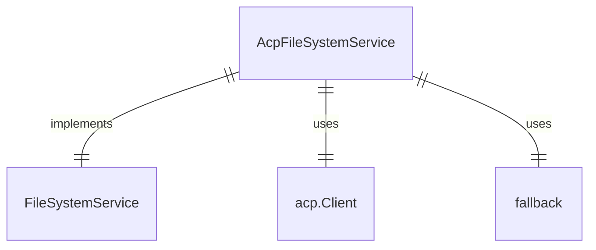

# fileSystemService.ts

这个文件定义了一个基于ACP客户端的文件系统服务实现。

## 功能概述

1. 实现FileSystemService接口
2. 根据能力配置决定是否使用ACP客户端或回退服务
3. 提供读取和写入文本文件的功能

## 类结构

### AcpFileSystemService
- 实现FileSystemService接口
- 构造函数接收ACP客户端、会话ID、能力配置和回退服务
- `readTextFile` 方法根据能力配置读取文件内容
- `writeTextFile` 方法根据能力配置写入文件内容

## 依赖关系

- 依赖 `@google/gemini-cli-core` 中的 `FileSystemService`
- 依赖 `./acp.js` 中的类型定义

## 函数级调用关系



## 变量级调用关系

```mermaid
erDiagram
    AcpFileSystemService {
        acp.Client client
        string sessionId
        acp.FileSystemCapability capabilities
        FileSystemService fallback
    }
```