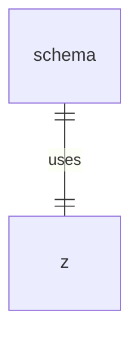

# schema.ts

这个文件定义了ACP协议的模式和类型。

## 功能概述

1. 定义代理和客户端的方法名称
2. 定义协议版本
3. 使用Zod定义各种请求和响应的模式
4. 导出类型定义

## 常量结构

### AGENT_METHODS
- 定义代理端的方法名称

### CLIENT_METHODS
- 定义客户端的方法名称

### PROTOCOL_VERSION
- 定义协议版本号

## 模式定义

### Zod模式
- 使用Zod定义各种请求和响应的验证模式
- 包括文件读写、权限请求、会话管理等模式

### 类型导出
- 导出基于Zod模式推断的TypeScript类型

## 依赖关系

- 依赖 `zod` 进行数据验证

## 函数级调用关系



## 变量级调用关系

```mermaid
erDiagram
    schema {
        object AGENT_METHODS
        object CLIENT_METHODS
        number PROTOCOL_VERSION
        z.ZodSchema writeTextFileRequestSchema
        z.ZodSchema readTextFileRequestSchema
        z.ZodSchema permissionOptionKindSchema
        z.ZodSchema roleSchema
        z.ZodSchema textResourceContentsSchema
        z.ZodSchema blobResourceContentsSchema
        z.ZodSchema toolKindSchema
        z.ZodSchema toolCallStatusSchema
        z.ZodSchema writeTextFileResponseSchema
        z.ZodSchema readTextFileResponseSchema
        z.ZodSchema requestPermissionOutcomeSchema
        z.ZodSchema cancelNotificationSchema
        z.ZodSchema authenticateRequestSchema
        z.ZodSchema authenticateResponseSchema
        z.ZodSchema newSessionResponseSchema
        z.ZodSchema loadSessionResponseSchema
        z.ZodSchema stopReasonSchema
        z.ZodSchema promptResponseSchema
        z.ZodSchema toolCallLocationSchema
        z.ZodSchema planEntrySchema
        z.ZodSchema permissionOptionSchema
        z.ZodSchema annotationsSchema
        z.ZodSchema requestPermissionResponseSchema
        z.ZodSchema fileSystemCapabilitySchema
        z.ZodSchema envVariableSchema
        z.ZodSchema mcpServerSchema
        z.ZodSchema agentCapabilitiesSchema
        z.ZodSchema authMethodSchema
        z.ZodSchema promptCapabilitiesSchema
        z.ZodSchema clientResponseSchema
        z.ZodSchema clientNotificationSchema
        z.ZodSchema embeddedResourceResourceSchema
        z.ZodSchema newSessionRequestSchema
        z.ZodSchema loadSessionRequestSchema
        z.ZodSchema initializeResponseSchema
        z.ZodSchema contentBlockSchema
        z.ZodSchema toolCallContentSchema
        z.ZodSchema toolCallSchema
        z.ZodSchema clientCapabilitiesSchema
        z.ZodSchema promptRequestSchema
        z.ZodSchema sessionUpdateSchema
        z.ZodSchema agentResponseSchema
        z.ZodSchema requestPermissionRequestSchema
        z.ZodSchema initializeRequestSchema
        z.ZodSchema sessionNotificationSchema
        z.ZodSchema clientRequestSchema
        z.ZodSchema agentRequestSchema
        z.ZodSchema agentNotificationSchema
    }
```