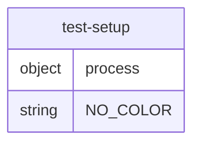

# test-setup.ts

这个文件是测试环境的设置文件。

## 功能概述

1. 重置NO_COLOR环境变量以确保测试行为一致
2. 导入自定义匹配器

## 代码结构

### 环境变量设置
- 检查并删除NO_COLOR环境变量

### 导入
- 导入自定义匹配器模块

## 依赖关系

- 依赖Node.js的process对象
- 依赖 `./src/test-utils/customMatchers.js` 中的自定义匹配器

## 函数级调用关系

## 变量级调用关系

