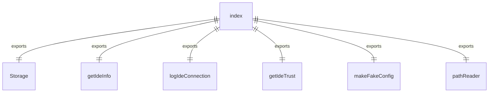
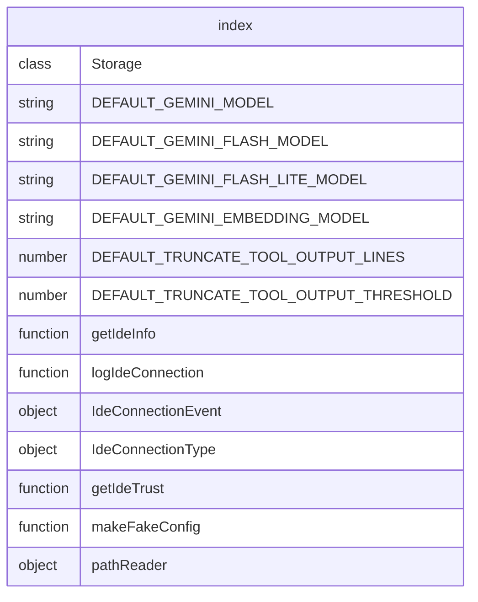

# index.ts

这个文件是core包的入口点，导出各种模块和常量。

## 功能概述

1. 导出核心模块
2. 导出默认模型常量
3. 导出默认配置常量
4. 导出IDE相关功能
5. 导出遥测功能
6. 导出工具函数
7. 导出测试工具

## 导出结构

### 核心模块导出
- 从 `./src/index.js` 导出所有内容

### 存储导出
- 导出 `Storage` 类

### 模型常量导出
- 导出默认的Gemini模型常量

### 配置常量导出
- 导出默认的工具输出截断配置

### IDE功能导出
- 导出IDE信息获取函数
- 导出IDE连接日志函数
- 导出IDE连接事件和类型

### 工具函数导出
- 导出IDE信任获取函数
- 导出路径读取器

### 测试工具导出
- 导出伪造配置生成函数

## 依赖关系

- 依赖 `./src/index.js` 中的核心模块
- 依赖 `./src/config/storage.js` 中的存储类
- 依赖 `./src/config/models.js` 中的模型常量
- 依赖 `./src/config/config.js` 中的配置常量
- 依赖 `./src/ide/detect-ide.js` 中的IDE检测函数
- 依赖 `./src/telemetry/loggers.js` 中的日志函数
- 依赖 `./src/telemetry/types.js` 中的遥测类型
- 依赖 `./src/utils/ide-trust.js` 中的IDE信任函数
- 依赖 `./src/test-utils/config.js` 中的测试配置函数
- 依赖 `./src/utils/pathReader.js` 中的路径读取器

## 函数级调用关系

## 变量级调用关系

