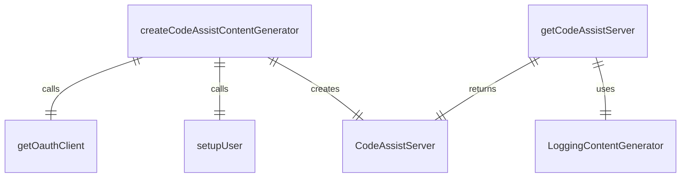
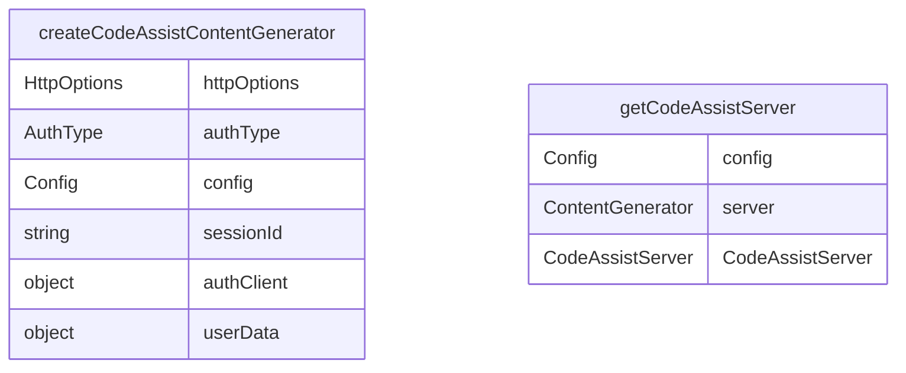

# 代码辅助功能 (codeAssist)

代码辅助功能提供与 Google Cloud Code Assist 服务的集成。

## 核心组件

### createCodeAssistContentGenerator()
创建代码辅助内容生成器：
- 根据认证类型选择实现
- 支持 Google 登录和 Cloud Shell 认证
- 初始化用户设置和项目信息

### getCodeAssistServer()
获取代码辅助服务器实例：
- 从配置中提取服务器实例
- 处理包装器类（如 LoggingContentGenerator）
- 返回 CodeAssistServer 或 undefined

## 服务器实现

### CodeAssistServer 类
实现 ContentGenerator 接口：
- `generateContent()` - 生成内容
- `generateContentStream()` - 流式生成内容
- `countTokens()` - 计算 token 数量
- `embedContent()` - 生成嵌入向量（未实现）

### HTTP 配置
支持自定义 HTTP 选项：
- 自定义请求头
- 会话 ID 支持
- 用户层级信息

### 端点配置
可配置的服务端点：
- 默认端点：https://cloudcode-pa.googleapis.com
- 可通过环境变量覆盖
- 支持不同 API 版本

## 认证集成

### OAuth2Client 集成
使用 Google Auth Library：
- 处理 OAuth2 认证流程
- 管理访问令牌
- 自动刷新令牌

### 用户设置
用户设置和项目信息：
- 项目 ID 管理
- 用户层级识别
- 会话跟踪

## API 方法

### 内容生成
- `generateContent()` - 同步内容生成
- `generateContentStream()` - 流式内容生成
- 支持中止信号处理

### 用户管理
- `onboardUser()` - 用户注册
- `loadCodeAssist()` - 加载代码辅助服务
- 处理 VPC Service Controls 影响的用户

### 设置管理
- `getCodeAssistGlobalUserSetting()` - 获取全局用户设置
- `setCodeAssistGlobalUserSetting()` - 设置全局用户设置

### Token 计数
- `countTokens()` - 计算内容的 token 数量

## 请求处理

### HTTP 请求
支持多种 HTTP 请求：
- `requestPost()` - POST 请求
- `requestGet()` - GET 请求
- `requestStreamingPost()` - 流式 POST 请求

### 流式响应处理
处理服务器发送事件 (SSE)：
- 解析流式响应数据
- 处理数据块分隔符
- 转换为 GenerateContentResponse 格式

### 错误处理
完善的错误处理机制：
- VPC Service Controls 错误处理
- 网络错误处理
- API 错误解析

## 数据转换

### 请求转换
- `toGenerateContentRequest()` - 转换生成内容请求
- `toCountTokenRequest()` - 转换 token 计数请求

### 响应转换
- `fromGenerateContentResponse()` - 转换生成内容响应
- `fromCountTokenResponse()` - 转换 token 计数响应

## 环境集成

### 会话管理
- 会话 ID 跟踪
- 用户层级识别
- 项目上下文管理

### 配置覆盖
支持环境变量覆盖：
- CODE_ASSIST_ENDPOINT - 服务端点
- 其他配置选项

## 安全特性

### 认证安全
- OAuth2 认证
- 安全令牌管理
- 自动令牌刷新

### 数据安全
- HTTPS 通信
- 敏感数据保护
- 符合安全最佳实践

## 函数级调用关系

## 变量级调用关系

