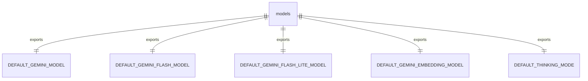
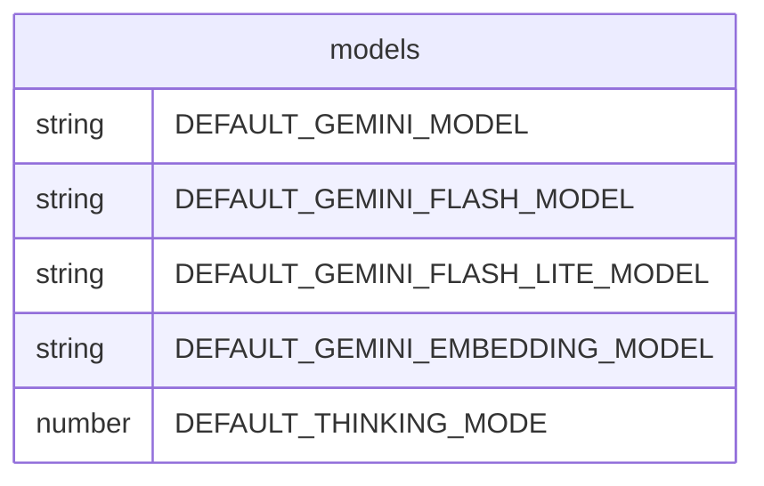

# 模型配置常量

此模块定义了在整个 Gemini CLI 应用程序中用于各种 AI 操作的默认模型常量。

## 默认模型

### DEFAULT_GEMINI_MODEL
```ts
export const DEFAULT_GEMINI_MODEL = 'gemini-2.5-pro';
```
未指定特定模型时用于大多数操作的默认 Gemini 模型。

### DEFAULT_GEMINI_FLASH_MODEL
```ts
export const DEFAULT_GEMINI_FLASH_MODEL = 'gemini-2.5-flash';
```
通常用于更快响应的默认 Gemini Flash 模型。

### DEFAULT_GEMINI_FLASH_LITE_MODEL
```ts
export const DEFAULT_GEMINI_FLASH_LITE_MODEL = 'gemini-2.5-flash-lite';
```
为轻量级操作优化的默认 Gemini Flash Lite 模型。

### DEFAULT_GEMINI_EMBEDDING_MODEL
```ts
export const DEFAULT_GEMINI_EMBEDDING_MODEL = 'gemini-embedding-001';
```
用于生成嵌入的默认模型。

## 思考模式

### DEFAULT_THINKING_MODE
```ts
export const DEFAULT_THINKING_MODE = -1;
```
默认的思考模式值。一些思考模型默认不启用动态思考，用 -1 表示。

## 函数级调用关系



## 变量级调用关系

