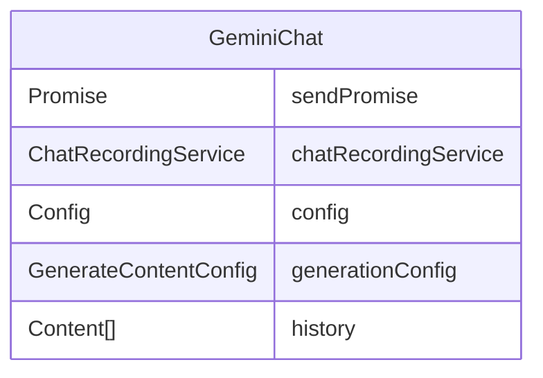

# GeminiChat 类

`GeminiChat` 类实现了与 Gemini AI 模型的聊天功能，管理聊天历史和消息交互。

## 主要功能

1. **聊天会话管理**：维护聊天状态和历史记录
2. **消息发送**：支持同步和流式消息发送
3. **历史记录处理**：管理聊天历史的添加、获取和清理
4. **工具集成**：设置和管理可用工具
5. **聊天记录服务**：记录聊天会话用于调试和分析

## 核心方法

### 消息发送
- `sendMessage()` - 发送消息并等待完整响应
- `sendMessageStream()` - 发送消息并以流式方式接收响应

### 历史记录管理
- `getHistory()` - 获取聊天历史记录
- `clearHistory()` - 清除聊天历史记录
- `addHistory()` - 添加消息到历史记录
- `setHistory()` - 设置完整的聊天历史记录

### 工具管理
- `setTools()` - 设置可用工具
- `getChatRecordingService()` - 获取聊天记录服务

## 内部方法

- `recordHistory()` - 记录用户输入和模型输出到历史记录
- `processStreamResponse()` - 处理流式响应数据
- `isValidResponse()` - 验证响应是否有效
- `extractCuratedHistory()` - 提取有效的聊天历史记录

## StreamEventType 枚举

定义了流式事件类型：
- `CHUNK` - 来自 API 的常规内容块
- `RETRY` - 即将重试的信号

## EmptyStreamError 类

自定义错误类，用于表示流完成但没有有效内容的情况，会触发重试机制。

## 函数级调用关系

```mermaid
erDiagram
    GeminiChat ||--|| ChatRecordingService : creates
    GeminiChat ||--|| sendMessage : calls
    GeminiChat ||--|| sendMessageStream : calls
    GeminiChat ||--|| makeApiCallAndProcessStream : calls
    GeminiChat ||--|| processStreamResponse : calls
    GeminiChat ||--|| recordHistory : calls
    GeminiChat ||--|| extractCuratedHistory : calls
    GeminiChat ||--|| isValidResponse : calls
    GeminiChat ||--|| isValidContent : calls
    GeminiChat ||--|| validateHistory : calls
    GeminiChat ||--|| setTools : calls
    GeminiChat ||--|| getHistory : calls
    GeminiChat ||--|| clearHistory : calls
    GeminiChat ||--|| addHistory : calls
    GeminiChat ||--|| setHistory : calls
    GeminiChat ||--|| stripThoughtsFromHistory : calls
    GeminiChat ||--|| getChatRecordingService : calls
    GeminiChat ||--|| recordCompletedToolCalls : calls
    GeminiChat ||--|| recordThoughtFromContent : calls
    sendMessage ||--|| createUserContent : calls
    sendMessage ||--|| getHistory : calls
    sendMessage ||--|| config.getContentGenerator : calls
    sendMessage ||--|| retryWithBackoff : calls
    sendMessage ||--|| handleFallback : calls
    sendMessage ||--|| chatRecordingService.recordMessage : calls
    sendMessageStream ||--|| createUserContent : calls
    sendMessageStream ||--|| getHistory : calls
    sendMessageStream ||--|| makeApiCallAndProcessStream : calls
    makeApiCallAndProcessStream ||--|| config.getContentGenerator : calls
    makeApiCallAndProcessStream ||--|| retryWithBackoff : calls
    makeApiCallAndProcessStream ||--|| handleFallback : calls
    makeApiCallAndProcessStream ||--|| processStreamResponse : calls
    processStreamResponse ||--|| isValidResponse : calls
    processStreamResponse ||--|| chatRecordingService.recordMessage : calls
    processStreamResponse ||--|| recordHistory : calls
    recordHistory ||--|| extractCuratedHistory : calls
    recordHistory ||--|| chatRecordingService.recordToolCalls : calls
    recordThoughtFromContent ||--|| chatRecordingService.recordThought : calls
```

## 变量级调用关系

