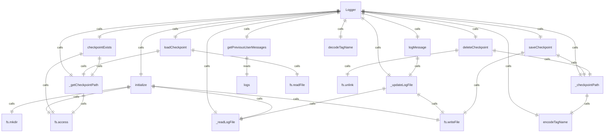
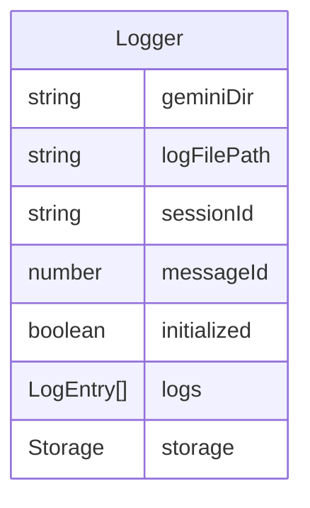

# Logger 类

`Logger` 类负责记录用户消息和管理聊天会话的日志功能。

## 主要功能

1. **消息日志记录**：记录用户输入的消息
2. **历史消息检索**：获取之前的用户消息
3. **检查点管理**：保存和加载聊天会话的检查点
4. **文件名编码**：安全地编码标签名称用于文件名

## 核心方法

### 日志记录
- `initialize()` - 初始化日志记录器
- `logMessage()` - 记录消息
- `getPreviousUserMessages()` - 获取之前的用户消息

### 检查点管理
- `saveCheckpoint()` - 保存聊天会话检查点
- `loadCheckpoint()` - 加载聊天会话检查点
- `deleteCheckpoint()` - 删除检查点
- `checkpointExists()` - 检查检查点是否存在

## MessageSenderType 枚举

定义消息发送者类型：
- `USER` - 用户发送的消息

## LogEntry 接口

定义日志条目的结构，包含：
- `sessionId` - 会话ID
- `messageId` - 消息ID
- `timestamp` - 时间戳
- `type` - 消息类型
- `message` - 消息内容

## 辅助函数

### encodeTagName()
将字符串编码为安全的文件名，替换特殊字符为URL编码格式。

### decodeTagName()
解码之前编码的文件名字符串。

## 函数级调用关系

## 变量级调用关系

