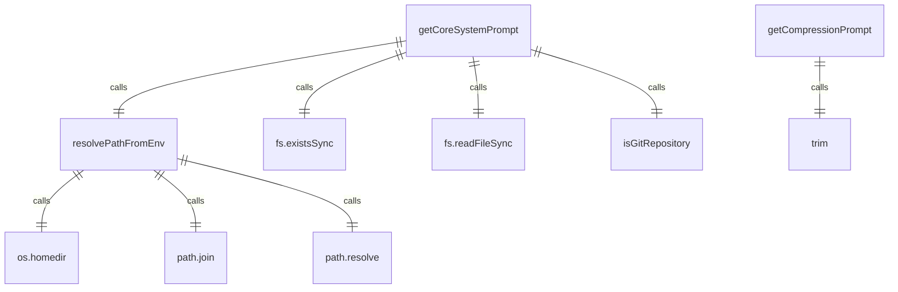
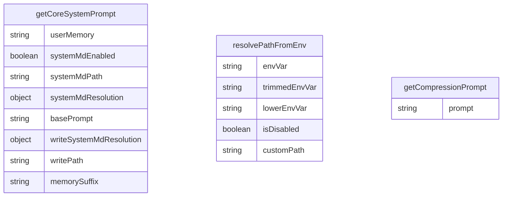

# 提示词系统

提示词系统负责生成和管理 AI 模型使用的系统提示。

## 核心函数

### getCoreSystemPrompt()
生成核心系统提示，包含 AI 助手的行为准则和工作流程。

主要包含以下内容：
1. **核心指令**：代码约定、库使用、风格结构等规范
2. **主要工作流程**：软件工程任务和新应用开发流程
3. **操作指南**：语调风格、安全规则、工具使用等
4. **示例**：展示正确的交互模式
5. **最终提醒**：强调高效安全协助的重要性

### getCompressionPrompt()
生成聊天历史压缩的系统提示，指导模型将整个历史压缩为结构化 XML 快照。

压缩快照包含以下结构：
- `overall_goal` - 用户的高级目标
- `key_knowledge` - 关键事实、约定和约束
- `file_system_state` - 文件系统状态
- `recent_actions` - 最近操作摘要
- `current_plan` - 当前计划

### resolvePathFromEnv()
解析环境变量中的路径，处理开关值和文件路径。

## 系统提示内容

核心系统提示包含以下关键部分：

### 核心指令
- 严格遵守项目约定
- 验证库/框架的使用
- 模仿现有代码的风格和结构
- 添加有价值的注释
- 主动完成用户请求

### 主要工作流程
1. **软件工程任务**：理解、计划、实现、验证
2. **新应用开发**：理解需求、提出计划、用户批准、实现、验证、征求反馈

### 操作指南
- 简洁直接的语调
- 最小化输出
- 安全第一原则
- 正确使用工具

### 工具使用
- 始终使用绝对路径
- 并行执行独立工具调用
- 解释修改命令的目的和影响
- 正确使用记忆工具

## 函数级调用关系

## 变量级调用关系

