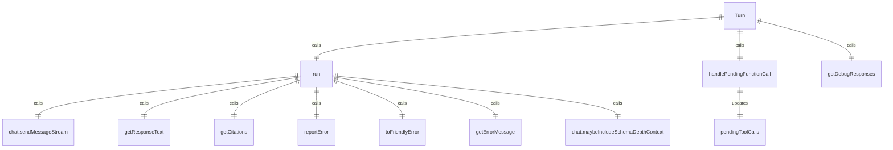
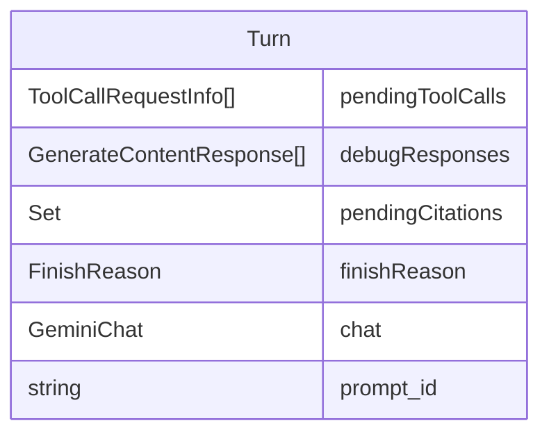

# Turn 类和相关类型

Turn 类管理服务器上下文中的代理循环轮次。

## Turn 类

### 主要功能
1. **运行管理**：执行聊天轮次并生成响应事件
2. **工具调用处理**：处理函数调用请求和响应
3. **错误处理**：捕获和处理聊天过程中的错误
4. **调试支持**：记录响应用于调试

### 核心方法
- `run()` - 执行聊天轮次，生成流式事件
- `getDebugResponses()` - 获取调试用的响应记录

### 属性
- `pendingToolCalls` - 待处理的工具调用列表
- `finishReason` - 对话结束原因

## 事件类型

### GeminiEventType 枚举
定义了各种 Gemini 事件类型：
- `Content` - 内容事件
- `ToolCallRequest` - 工具调用请求事件
- `ToolCallResponse` - 工具调用响应事件
- `ToolCallConfirmation` - 工具调用确认事件
- `UserCancelled` - 用户取消事件
- `Error` - 错误事件
- `ChatCompressed` - 聊天压缩事件
- `Thought` - 思考事件
- `MaxSessionTurns` - 最大会话轮次事件
- `Finished` - 完成事件
- `LoopDetected` - 循环检测事件
- `Citation` - 引用事件
- `Retry` - 重试事件

## 数据结构

### ServerGeminiStreamEvent
联合类型，包含所有可能的服务器 Gemini 流事件。

### CompressionStatus 枚举
定义聊天压缩状态：
- `COMPRESSED` - 压缩成功
- `COMPRESSION_FAILED_INFLATED_TOKEN_COUNT` - 压缩失败（token 数量增加）
- `COMPRESSION_FAILED_TOKEN_COUNT_ERROR` - 压缩失败（token 计数错误）
- `NOOP` - 无需操作

### ChatCompressionInfo 接口
包含聊天压缩信息：
- `originalTokenCount` - 原始 token 数量
- `newTokenCount` - 新 token 数量
- `compressionStatus` - 压缩状态

## 辅助函数

### getCitations()
从生成内容响应中提取引用信息。

## 函数级调用关系

## 变量级调用关系

