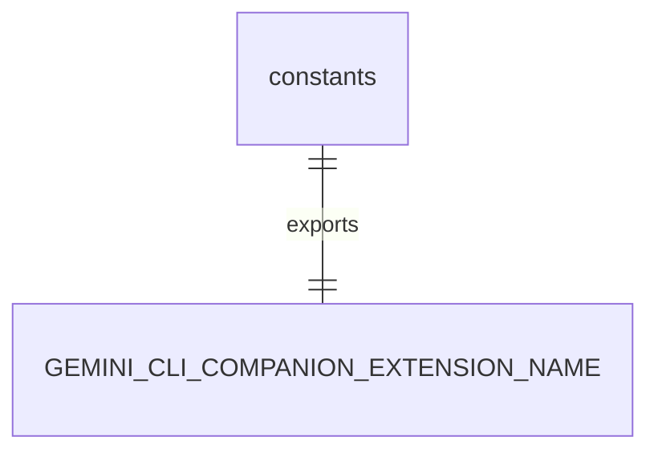
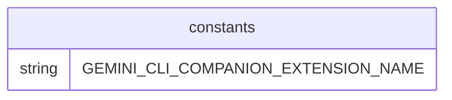

# constants.ts

此文件包含在 Gemini CLI 的 IDE 集成功能中使用的常量。

## 常量

### GEMINI_CLI_COMPANION_EXTENSION_NAME

```typescript
export const GEMINI_CLI_COMPANION_EXTENSION_NAME = 'Gemini CLI Companion';
```

Gemini CLI 配套扩展在 IDE 中的显示名称。

## 函数级调用关系



## 变量级调用关系

