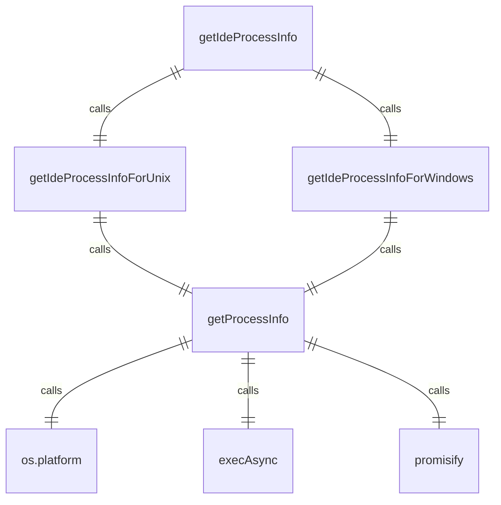
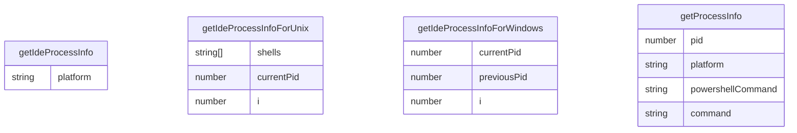

# process-utils.ts

此文件提供了遍历进程树以识别启动 Gemini CLI 的 IDE 进程的实用程序。

## 常量

### MAX_TRAVERSAL_DEPTH

```typescript
const MAX_TRAVERSAL_DEPTH = 32;
```

向上遍历进程树的最大深度，以防止无限循环。

## 函数

### getProcessInfo

```typescript
async function getProcessInfo(pid: number): Promise<{
  parentPid: number;
  name: string;
  command: string;
}>
```

获取给定进程 ID 的父进程 ID、名称和命令。

**参数:**
- `pid`: 要检查的进程 ID

**返回:**
- 解析为父进程的 PID、名称和命令的承诺

**实现细节:**
- 使用平台特定命令：
  - Windows: PowerShell `Get-CimInstance Win32_Process` 命令
  - Unix-like: `ps -o ppid=,command= -p` 命令
- 优雅地处理错误，返回默认值

### getIdeProcessInfoForUnix

```typescript
async function getIdeProcessInfoForUnix(): Promise<{
  pid: number;
  command: string;
}>
```

在类 Unix 系统上查找 IDE 进程信息。

**返回:**
- 解析为 IDE 进程的 PID 和命令的承诺

**策略:**
1. 查找启动 CLI 的 shell 进程
2. 查找该 shell 的父进程（IDE）
3. 向上遍历一级以获取真正的 IDE 进程
4. 使用已知 shell 列表：`['zsh', 'bash', 'sh', 'tcsh', 'csh', 'ksh', 'fish', 'dash']`

### getIdeProcessInfoForWindows

```typescript
async function getIdeProcessInfoForWindows(): Promise<{
  pid: number;
  command: string;
}>
```

在 Windows 上查找 IDE 进程信息。

**返回:**
- 解析为 IDE 进程的 PID 和命令的承诺

**策略:**
1. 查找根进程的曾孙进程
2. 向上遍历进程树寻找根进程
3. 将根进程的孙子作为 IDE 进程返回

### getIdeProcessInfo

```typescript
export async function getIdeProcessInfo(): Promise<{
  pid: number;
  command: string;
}>
```

向上遍历进程树以查找 IDE 的进程 ID 和命令。

**返回:**
- 解析为 IDE 进程的 PID 和命令的承诺

**实现细节:**
- 根据操作系统使用不同策略
- Windows 委托给 `getIdeProcessInfoForWindows()`
- 类 Unix 系统委托给 `getIdeProcessInfoForUnix()`
- 如果无法可靠地识别 IDE 进程，将顶级祖先进程 ID 和命令作为备用返回

## 函数级调用关系



## 变量级调用关系

