# MCP OAuth 提供者 (MCPOAuthProvider)

MCP OAuth 提供者负责处理与 MCP 服务器的 OAuth 认证流程。

## 主要功能

1. **OAuth 认证**：执行完整的 OAuth 授权码流程
2. **令牌管理**：获取、刷新和存储访问令牌
3. **动态注册**：支持动态客户端注册
4. **PKCE 支持**：使用 PKCE 增强安全性

## 核心组件

### MCPOAuthConfig
OAuth 配置接口：
- `enabled` - 是否启用 OAuth
- `clientId` - 客户端 ID
- `clientSecret` - 客户端密钥
- `authorizationUrl` - 授权 URL
- `tokenUrl` - 令牌 URL
- `scopes` - 请求的作用域
- `audiences` - 请求的受众
- `redirectUri` - 重定向 URI
- `tokenParamName` - SSE 连接的令牌参数名

## 核心方法

### authenticate()
执行完整的 OAuth 认证流程：
1. OAuth 发现（如果需要）
2. 动态客户端注册（如果没有客户端 ID）
3. 生成 PKCE 参数
4. 构建授权 URL
5. 启动回调服务器
6. 打开浏览器进行认证
7. 等待回调并交换令牌
8. 保存令牌

### getValidToken()
获取有效的访问令牌：
- 检查存储的令牌是否有效
- 如果过期则刷新令牌
- 返回有效的访问令牌

### refreshAccessToken()
刷新访问令牌：
- 使用刷新令牌获取新令牌
- 更新存储的令牌信息

## 认证流程

### OAuth 发现
支持多种 OAuth 发现方式：
- 标准 MCP OAuth 发现
- 从 WWW-Authenticate 头发现
- 手动配置

### 动态客户端注册
支持动态客户端注册：
- 向授权服务器注册客户端
- 获取客户端凭据
- 自动处理注册过程

### PKCE 流程
使用 PKCE 增强安全性：
- 生成代码验证器和挑战
- 创建随机状态参数
- 防止 CSRF 攻击

## 令牌管理

### 令牌存储
使用 MCPOAuthTokenStorage 存储令牌：
- 持久化存储访问令牌
- 安全存储刷新令牌
- 管理令牌过期时间

### 令牌刷新
自动刷新过期令牌：
- 检测令牌过期
- 使用刷新令牌获取新令牌
- 更新存储的令牌信息

## 用户交互

### 浏览器打开
安全地打开浏览器进行认证：
- 使用安全的浏览器启动器
- 提供手动复制 URL 的选项
- 显示友好的用户指导

### 回调处理
处理 OAuth 回调：
- 启动本地 HTTP 服务器
- 验证状态参数
- 处理错误情况
- 超时处理

## 错误处理

### 认证错误
处理各种认证错误：
- 授权错误
- 令牌交换错误
- 网络错误
- 配置错误

### 用户友好错误
提供用户友好的错误信息：
- 清晰的错误描述
- 建议的解决方案
- 详细的调试信息

## 安全特性

### CSRF 保护
使用状态参数防止 CSRF 攻击：
- 生成随机状态值
- 验证回调中的状态
- 拒绝不匹配的状态

### PKCE 保护
使用 PKCE 防止授权码拦截：
- 生成代码验证器
- 计算代码挑战
- 在令牌交换中使用验证器

### 安全存储
安全存储敏感信息：
- 令牌加密存储
- 刷新令牌安全处理
- 避免内存中的敏感数据泄露

## 函数级调用关系

## 变量级调用关系

```mermaid
erDiagram
    MCPOAuthProvider {
        MCPOAuthTokenStorage tokenStorage
        PKCEParams pkceParams
        string REDIRECT_PORT
        string REDIRECT_PATH
        number HTTP_OK
    }
    
    authenticate {
        string serverName
        MCPOAuthConfig config
        string mcpServerUrl
        OAuthAuthorizationResponse callbackPromise
        OAuthTokenResponse tokenResponse
        OAuthToken token
    }
    
    getValidToken {
        string serverName
        MCPOAuthConfig config
        object credentials
        OAuthToken token
        OAuthTokenResponse newTokenResponse
        OAuthToken newToken
    }
    
    refreshAccessToken {
        MCPOAuthConfig config
        string refreshToken
        string tokenUrl
        string mcpServerUrl
        object params
        object response
        string responseText
        string contentType
        OAuthTokenResponse tokenResponse
    }
    
    registerClient {
        string registrationUrl
        MCPOAuthConfig config
        string redirectUri
        OAuthClientRegistrationRequest registrationRequest
        object response
        string errorText
        OAuthClientRegistrationResponse registrationResponse
    }
    
    exchangeCodeForToken {
        MCPOAuthConfig config
        string code
        string codeVerifier
        string mcpServerUrl
        string redirectUri
        object params
        object response
        string responseText
        string contentType
        OAuthTokenResponse tokenResponse
    }
    
    startCallbackServer {
        string expectedState
        object server
        object url
        string code
        string state
        string error
    }
    
    buildAuthorizationUrl {
        MCPOAuthConfig config
        PKCEParams pkceParams
        string mcpServerUrl
        string redirectUri
        object params
        object url
    }
    
    generatePKCEParams {
        string codeVerifier
        string codeChallenge
        string state
    }
    
    discoverOAuthFromMCPServer {
        string mcpServerUrl
    }
```

