# oauth-token-storage.ts

此文件实现了 `MCPOAuthTokenStorage` 类，用于管理 MCP OAuth 令牌存储和检索。

## 类: MCPOAuthTokenStorage

用于管理 MCP OAuth 令牌存储和检索的类。

### 方法

#### getTokenFilePath

```typescript
private getTokenFilePath(): string
```

获取令牌存储文件的路径。

**返回:**
- 令牌存储文件的完整路径

#### ensureConfigDir

```typescript
private async ensureConfigDir(): Promise<void>
```

确保存储目录存在。

#### getAllCredentials

```typescript
async getAllCredentials(): Promise<Map<string, OAuthCredentials>>
```

加载所有存储的 MCP OAuth 令牌。

**返回:**
- 服务器名称到凭据的映射

#### listServers

```typescript
async listServers(): Promise<string[]>
```

列出存储凭据的所有服务器。

**返回:**
- 服务器名称数组

#### setCredentials

```typescript
async setCredentials(credentials: OAuthCredentials): Promise<void>
```

设置服务器的凭据。

**参数:**
- `credentials`: 要存储的凭据

#### saveToken

```typescript
async saveToken(
  serverName: string,
  token: OAuthToken,
  clientId?: string,
  tokenUrl?: string,
  mcpServerUrl?: string,
): Promise<void>
```

为特定 MCP 服务器保存令牌。

**参数:**
- `serverName`: MCP 服务器的名称
- `token`: 要保存的 OAuth 令牌
- `clientId`: 可选的用于此令牌的客户端 ID
- `tokenUrl`: 可选的用于此令牌的令牌 URL
- `mcpServerUrl`: 可选的 MCP 服务器 URL

#### getCredentials

```typescript
async getCredentials(serverName: string): Promise<OAuthCredentials | null>
```

获取特定 MCP 服务器的令牌。

**参数:**
- `serverName`: MCP 服务器的名称

**返回:**
- 存储的凭据或如果未找到则返回 null

#### deleteCredentials

```typescript
async deleteCredentials(serverName: string): Promise<void>
```

移除特定 MCP 服务器的令牌。

**参数:**
- `serverName`: MCP 服务器的名称

#### isTokenExpired

```typescript
isTokenExpired(token: OAuthToken): boolean
```

检查令牌是否已过期。

**参数:**
- `token`: 要检查的令牌

**返回:**
- 如果令牌已过期则返回 true

#### clearAll

```typescript
async clearAll(): Promise<void>
```

清除所有存储的 MCP OAuth 令牌。

## 函数级调用关系


## 变量级调用关系

```mermaid
erDiagram
    MCPOAuthTokenStorage {
        string TOKENS_FILENAME
    }
    
    getAllCredentials {
        string filePath
        string data
        object parsed
        Map credentials
    }
    
    listServers {
        Map credentials
        string[] serverNames
    }
    
    setCredentials {
        string filePath
        string data
        OAuthCredentials credentials
    }
    
    saveToken {
        OAuthCredentials existingCredentials
        OAuthCredentials newCredentials
    }
    
    getCredentials {
        Map credentials
        OAuthCredentials credential
    }
    
    deleteCredentials {
        string filePath
    }
    
    clearAll {
        string dirPath
    }
    
    ensureConfigDir {
        string configDir
    }
    
    getTokenFilePath {
        string configDir
        string filePath
    }
    
    isTokenExpired {
        OAuthToken token
        number currentTime
    }
```

