# token-storage/file-token-storage.ts

此文件实现了 `FileTokenStorage` 类，该类为 Model Context Protocol (MCP) 实现中的 OAuth 令牌提供基于加密文件的存储。

## 类: FileTokenStorage

带加密的基于文件的令牌存储。

### 属性

- `private readonly tokenFilePath: string` - 令牌存储文件的路径
- `private readonly encryptionKey: Buffer` - 从系统信息派生的加密密钥

### 构造函数

```typescript
constructor(serviceName: string)
```

**参数:**
- `serviceName`: 用于存储的服务名称

### 私有方法

#### deriveEncryptionKey

```typescript
private deriveEncryptionKey(): Buffer
```

从系统信息派生加密密钥。

**返回:**
- 派生的加密密钥

#### encrypt

```typescript
private encrypt(text: string): string
```

使用 AES-256-GCM 加密文本。

**参数:**
- `text`: 要加密的文本

**返回:**
- 格式为 "iv:authTag:encrypted" 的加密文本

#### decrypt

```typescript
private decrypt(encryptedData: string): string
```

使用 AES-256-GCM 解密文本。

**参数:**
- `encryptedData`: 格式为 "iv:authTag:encrypted" 的加密数据

**返回:**
- 解密后的文本

**抛出:**
- 如果数据格式无效或解密失败则抛出错误

#### ensureDirectoryExists

```typescript
private async ensureDirectoryExists(): Promise<void>
```

确保令牌存储目录存在并具有适当的权限。

#### loadTokens

```typescript
private async loadTokens(): Promise<Map<string, OAuthCredentials>>
```

从存储文件加载令牌。

**返回:**
- 服务器名称到凭据的映射

**抛出:**
- 如果令牌文件不存在或已损坏则抛出错误

#### saveTokens

```typescript
private async saveTokens(
  tokens: Map<string, OAuthCredentials>,
): Promise<void>
```

将令牌保存到存储文件。

**参数:**
- `tokens`: 服务器名称到凭据的映射

### 公共方法

#### getCredentials

```typescript
async getCredentials(serverName: string): Promise<OAuthCredentials | null>
```

获取特定服务器的凭据。

**参数:**
- `serverName`: 服务器名称

**返回:**
- 凭据或如果未找到或已过期则返回 null

#### setCredentials

```typescript
async setCredentials(credentials: OAuthCredentials): Promise<void>
```

设置服务器的凭据。

**参数:**
- `credentials`: 要存储的凭据

#### deleteCredentials

```typescript
async deleteCredentials(serverName: string): Promise<void>
```

删除服务器的凭据。

**参数:**
- `serverName`: 服务器名称

**抛出:**
- 如果未找到凭据则抛出错误

#### listServers

```typescript
async listServers(): Promise<string[]>
```

列出存储凭据的所有服务器。

**返回:**
- 服务器名称数组

#### getAllCredentials

```typescript
async getAllCredentials(): Promise<Map<string, OAuthCredentials>>
```

获取所有存储的凭据。

**返回:**
- 服务器名称到凭据的映射（不包括已过期的令牌）

#### clearAll

```typescript
async clearAll(): Promise<void>
```

通过删除存储文件来清除所有存储的凭据。

## 函数级调用关系


## 变量级调用关系

```mermaid
erDiagram
    FileTokenStorage {
        string tokenFilePath
        Buffer encryptionKey
        string serviceName
    }
    
    deriveEncryptionKey {
        string machineId
        string username
        Buffer key
    }
    
    encrypt {
        string text
        Buffer iv
        object cipher
        string encrypted
        Buffer authTag
        string result
    }
    
    decrypt {
        string encryptedData
        string[] parts
        Buffer iv
        Buffer authTag
        Buffer encrypted
        object decipher
        string decrypted
    }
    
    ensureDirectoryExists {
        string dirPath
    }
    
    loadTokens {
        string data
        string decryptedData
        object parsed
        Map tokens
    }
    
    saveTokens {
        Map tokens
        object serialized
        string data
        string encryptedData
    }
    
    getCredentials {
        Map tokens
        OAuthCredentials credentials
    }
    
    setCredentials {
        Map tokens
        OAuthCredentials credentials
    }
    
    deleteCredentials {
        Map tokens
    }
    
    listServers {
        Map tokens
        string[] serverNames
    }
    
    getAllCredentials {
        Map tokens
        Map validTokens
    }
    
    clearAll {
        string filePath
    }
```

