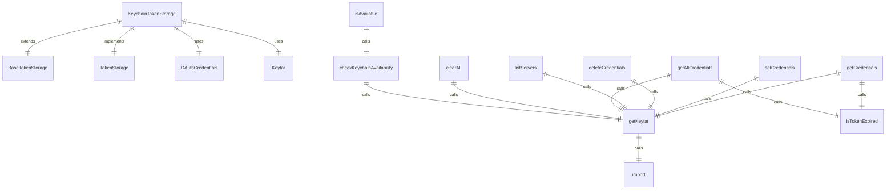

# token-storage/keychain-token-storage.ts

此文件实现了 `KeychainTokenStorage` 类，该类为 Model Context Protocol (MCP) 实现中的 OAuth 令牌提供基于钥匙串的存储。

## 接口

### Keytar

keytar 模块函数的接口。

```typescript
interface Keytar {
  getPassword(service: string, account: string): Promise<string | null>;
  setPassword(
    service: string,
    account: string,
    password: string,
  ): Promise<void>;
  deletePassword(service: string, account: string): Promise<boolean>;
  findCredentials(
    service: string,
  ): Promise<Array<{ account: string; password: string }>>;
}
```

## 类: KeychainTokenStorage

基于钥匙串的令牌存储实现。

### 属性

- `private keychainAvailable: boolean | null = null` - 钥匙串是否可用
- `private keytarModule: Keytar | null = null` - keytar 模块实例
- `private keytarLoadAttempted = false` - 是否已尝试加载 keytar

### 方法

#### getKeytar

```typescript
async getKeytar(): Promise<Keytar | null>
```

获取 keytar 模块实例，必要时加载它。

**返回:**
- keytar 模块实例或如果不可用则返回 null

#### getCredentials

```typescript
async getCredentials(serverName: string): Promise<OAuthCredentials | null>
```

从钥匙串获取特定服务器的凭据。

**参数:**
- `serverName`: 服务器名称

**返回:**
- 凭据或如果未找到或已过期则返回 null

**抛出:**
- 如果钥匙串不可用或无法解析凭据则抛出错误

#### setCredentials

```typescript
async setCredentials(credentials: OAuthCredentials): Promise<void>
```

在钥匙串中设置服务器的凭据。

**参数:**
- `credentials`: 要存储的凭据

**抛出:**
- 如果钥匙串不可用或凭据无效则抛出错误

#### deleteCredentials

```typescript
async deleteCredentials(serverName: string): Promise<void>
```

从钥匙串中删除服务器的凭据。

**参数:**
- `serverName`: 服务器名称

**抛出:**
- 如果钥匙串不可用或未找到凭据则抛出错误

#### listServers

```typescript
async listServers(): Promise<string[]>
```

列出钥匙串中存储凭据的所有服务器。

**返回:**
- 服务器名称数组

#### getAllCredentials

```typescript
async getAllCredentials(): Promise<Map<string, OAuthCredentials>>
```

从钥匙串获取所有存储的凭据。

**返回:**
- 服务器名称到凭据的映射（不包括已过期的令牌）

#### clearAll

```typescript
async clearAll(): Promise<void>
```

从钥匙串中清除所有存储的凭据。

**抛出:**
- 如果钥匙串不可用或某些凭据无法删除则抛出错误

#### checkKeychainAvailability

```typescript
async checkKeychainAvailability(): Promise<boolean>
```

通过执行设置-获取-删除周期来检查钥匙串是否可用。

**返回:**
- 如果钥匙串可用且正常工作则返回 true

#### isAvailable

```typescript
async isAvailable(): Promise<boolean>
```

检查钥匙串存储是否可用。

**返回:**
- 如果钥匙串可用则返回 true

### 常量

- `KEYCHAIN_TEST_PREFIX = '__keychain_test__'` - 钥匙串中测试账户的前缀

## 函数级调用关系



## 变量级调用关系

```mermaid
erDiagram
    KeychainTokenStorage {
        boolean keychainAvailable
        Keytar keytarModule
        boolean keytarLoadAttempted
        string serviceName
    }
    
    getKeytar {
        Keytar keytar
    }
    
    getCredentials {
        Keytar keytar
        string accountName
        string credentialsJson
        OAuthCredentials credentials
    }
    
    setCredentials {
        Keytar keytar
        string accountName
        string credentialsJson
    }
    
    deleteCredentials {
        Keytar keytar
        string accountName
        boolean deleted
    }
    
    listServers {
        Keytar keytar
        Array credentials
        string[] serverNames
    }
    
    getAllCredentials {
        Keytar keytar
        Array credentials
        Map allCredentials
        OAuthCredentials parsedCredentials
    }
    
    clearAll {
        Keytar keytar
        Array credentials
        string accountName
    }
    
    checkKeychainAvailability {
        Keytar keytar
        string testAccount
        string testPassword
        boolean retrieved
        boolean deleted
    }
    
    isAvailable {
        boolean available
    }
```

