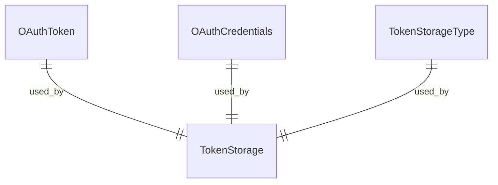
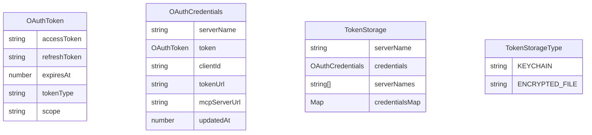

# token-storage/types.ts

此文件定义了 Model Context Protocol (MCP) 实现中用于 OAuth 令牌存储的类型。

## 接口

### OAuthToken

OAuth 令牌的接口。

```typescript
export interface OAuthToken {
  accessToken: string;
  refreshToken?: string;
  expiresAt?: number;
  tokenType: string;
  scope?: string;
}
```

### OAuthCredentials

存储的 OAuth 凭据的接口。

```typescript
export interface OAuthCredentials {
  serverName: string;
  token: OAuthToken;
  clientId?: string;
  tokenUrl?: string;
  mcpServerUrl?: string;
  updatedAt: number;
}
```

### TokenStorage

令牌存储实现的接口。

```typescript
export interface TokenStorage {
  getCredentials(serverName: string): Promise<OAuthCredentials | null>;
  setCredentials(credentials: OAuthCredentials): Promise<void>;
  deleteCredentials(serverName: string): Promise<void>;
  listServers(): Promise<string[]>;
  getAllCredentials(): Promise<Map<string, OAuthCredentials>>;
  clearAll(): Promise<void>;
}
```

## 枚举

### TokenStorageType

令牌存储类型的枚举。

```typescript
export enum TokenStorageType {
  KEYCHAIN = 'keychain',
  ENCRYPTED_FILE = 'encrypted_file',
}
```

## 函数级调用关系



## 变量级调用关系

