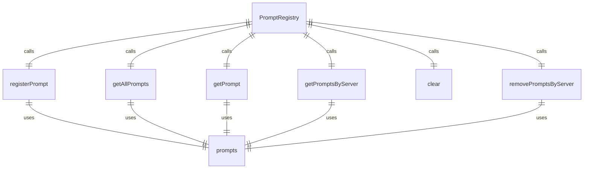
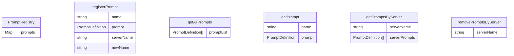

# 提示词注册表 (PromptRegistry)

提示词注册表负责管理所有注册的提示词定义。

## 主要功能

1. **提示词注册**：注册和管理提示词定义
2. **提示词发现**：发现和检索提示词
3. **服务器管理**：按服务器管理提示词
4. **命名冲突处理**：处理同名提示词

## 核心方法

### registerPrompt()
注册提示词定义：
- 检查是否已存在同名提示词
- 处理命名冲突（添加服务器前缀）
- 存储提示词定义

### getAllPrompts()
获取所有注册的提示词：
- 返回排序后的提示词列表
- 按名称字母顺序排列

### getPrompt()
获取特定提示词定义：
- 根据名称查找提示词
- 返回提示词定义或 undefined

### getPromptsByServer()
获取特定服务器的提示词：
- 根据服务器名称过滤提示词
- 返回排序后的提示词列表

### clear()
清空所有提示词：
- 移除所有注册的提示词
- 重置注册表状态

### removePromptsByServer()
移除特定服务器的提示词：
- 根据服务器名称移除提示词
- 保持其他服务器的提示词

## 数据结构

### 提示词存储
使用 Map 存储提示词：
- 键：提示词名称
- 值：提示词定义
- 支持快速查找和更新

## 命名冲突处理

当注册同名提示词时：
1. 检测命名冲突
2. 重命名为 "服务器名_提示词名" 格式
3. 发出警告信息
4. 继续注册过程

## 排序和检索

### 名称排序
所有提示词列表按名称字母顺序排序：
- 提供一致的检索体验
- 支持可预测的遍历顺序

### 服务器分组
支持按服务器分组检索：
- 便于管理不同服务器的提示词
- 支持服务器级别的操作

## 使用场景

### MCP 集成
与 MCP 服务器集成：
- 自动注册发现的提示词
- 管理多个 MCP 服务器的提示词
- 支持动态提示词更新

### 提示词发现
支持提示词发现功能：
- 列出所有可用提示词
- 按服务器筛选提示词
- 提供提示词详细信息

### 提示词执行
为提示词执行提供注册表：
- 查找提示词定义
- 验证提示词存在性
- 获取提示词元数据

## 函数级调用关系

## 变量级调用关系

