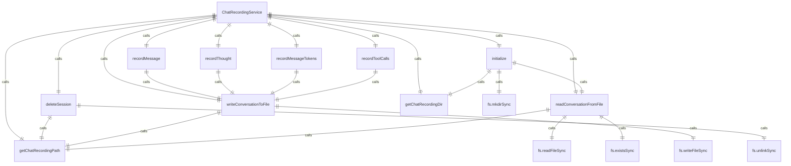

# 聊天记录服务 (ChatRecordingService)

聊天记录服务负责自动记录聊天会话到磁盘，提供完整的会话历史记录功能。

## 主要功能

1. **会话记录**：记录用户和助手的所有消息
2. **工具调用跟踪**：记录工具调用及其执行结果
3. **Token 使用统计**：记录消息的 Token 使用情况
4. **助手思考过程**：记录助手的推理和思考过程
5. **会话恢复**：支持从现有会话恢复

## 核心数据结构

### ConversationRecord
完整的会话记录结构：
- `sessionId` - 会话ID
- `projectHash` - 项目哈希
- `startTime` - 会话开始时间
- `lastUpdated` - 最后更新时间
- `messages` - 消息记录列表

### MessageRecord
单条消息记录：
- `id` - 消息ID
- `timestamp` - 时间戳
- `content` - 消息内容
- `type` - 消息类型（user/gemini）

### ToolCallRecord
工具调用记录：
- `id` - 调用ID
- `name` - 工具名称
- `args` - 调用参数
- `result` - 执行结果
- `status` - 执行状态
- `timestamp` - 时间戳

## 核心方法

### 初始化
- `initialize()` - 初始化聊天记录服务
- 支持创建新会话或从现有会话恢复

### 记录操作
- `recordMessage()` - 记录消息
- `recordThought()` - 记录助手思考
- `recordMessageTokens()` - 记录消息 Token 使用
- `recordToolCalls()` - 记录工具调用

### 会话管理
- `deleteSession()` - 删除会话记录

## 特殊功能

### 实时更新
- 自动将记录写入磁盘
- 避免重复写入相同内容
- 时间戳自动更新

### 数据丰富
- 自动添加工具显示名称和描述
- 丰富工具调用的元数据
- 格式化输出用于显示

### 会话恢复
- 支持从现有会话文件恢复
- 更新会话ID以匹配当前会话
- 保持历史记录完整性

### 文件管理
- 自动创建聊天记录目录
- 使用时间戳和会话ID命名文件
- 安全的文件读写操作

## 函数级调用关系

## 变量级调用关系

```mermaid
erDiagram
    ChatRecordingService {
        ConversationRecord conversation
        string sessionId
        string projectHash
        boolean initialized
    }
    initialize {
        string existingSessionId
        string projectRoot
        string projectHash
    }
    recordMessage {
        MessageRecord messageRecord
    }
    recordThought {
        MessageRecord thoughtRecord
    }
    recordMessageTokens {
        string messageId
        object tokenUsage
    }
    recordToolCalls {
        ToolCallRecord[] toolCallRecords
    }
    deleteSession {
        string recordingPath
    }
    writeConversationToFile {
        string recordingPath
        string conversationJson
    }
    readConversationFromFile {
        string recordingPath
        string conversationJson
    }
    getChatRecordingDir {
        string geminiDir
        string chatRecordingsDir
    }
    getChatRecordingPath {
        string chatRecordingsDir
        string filename
    }
```

