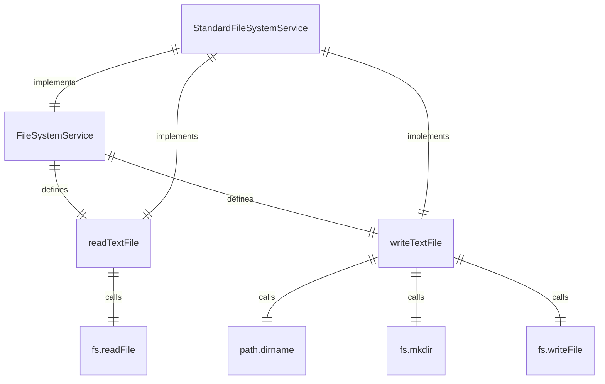

# 文件系统服务 (FileSystemService)

文件系统服务提供文件读写操作的抽象接口和标准实现。

## 核心接口

### FileSystemService 接口
定义文件系统操作的抽象接口：
- `readTextFile()` - 读取文本文件
- `writeTextFile()` - 写入文本文件

## 核心实现

### StandardFileSystemService 类
标准文件系统实现：
- 使用 Node.js fs/promises 模块
- 提供异步文件读写操作
- 支持 UTF-8 编码

## 功能详解

### 文本文件读取 (readTextFile)
- 异步读取指定路径的文本文件
- 返回文件内容作为字符串
- 使用 UTF-8 编码

### 文本文件写入 (writeTextFile)
- 异步将文本内容写入指定文件
- 使用 UTF-8 编码
- 自动创建不存在的目录

## 设计模式

### 抽象接口模式
通过抽象接口支持不同的文件系统实现：
- 标准文件系统实现
- 可能的内存文件系统实现
- 可能的虚拟文件系统实现

### 依赖注入
Config 类通过 `setFileSystemService()` 方法支持注入自定义实现：
- 允许测试时使用模拟实现
- 支持特殊环境下的自定义实现
- 保持代码的可扩展性

## 使用场景

### 标准使用
在大多数情况下使用标准实现：
- 读取项目文件
- 写入生成的代码
- 处理配置文件

### 测试使用
在测试中使用模拟实现：
- 避免实际文件系统操作
- 控制测试环境
- 提高测试速度

### 特殊环境
在受限环境中使用自定义实现：
- 沙箱环境
- 内存文件系统
- 网络文件系统

## 函数级调用关系



## 变量级调用关系

```mermaid
erDiagram
    StandardFileSystemService {
        // No instance variables
    }
    readTextFile {
        string filePath
    }
    writeTextFile {
        string filePath
        string content
        string dirPath
    }
```