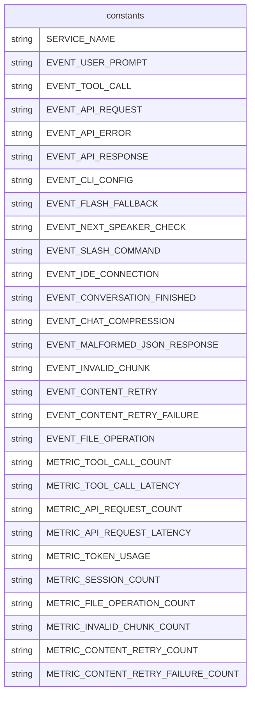

# Telemetry Constants

此模块定义了在整个 Gemini CLI 应用程序中用于遥测跟踪的常量。这些常量用于识别特定事件和指标，用于监控和分析目的。

## 服务名称

### SERVICE_NAME
```ts
export const SERVICE_NAME = 'gemini-cli';
```
遥测系统中 Gemini CLI 服务的标识符。

## 事件常量

这些常量表示可以跟踪的不同类型的事件：

- `EVENT_USER_PROMPT`: 用户提交提示
- `EVENT_TOOL_CALL`: 调用工具
- `EVENT_API_REQUEST`: 发出 API 请求
- `EVENT_API_ERROR`: 发生 API 错误
- `EVENT_API_RESPONSE`: 接收 API 响应
- `EVENT_CLI_CONFIG`: CLI 配置更改
- `EVENT_FLASH_FALLBACK`: 回退到 flash 模型
- `EVENT_NEXT_SPEAKER_CHECK`: 检查下一位发言者
- `EVENT_SLASH_COMMAND`: 执行斜杠命令
- `EVENT_IDE_CONNECTION`: IDE 连接状态更改
- `EVENT_CONVERSATION_FINISHED`: 对话会话结束
- `EVENT_CHAT_COMPRESSION`: 聊天历史压缩
- `EVENT_MALFORMED_JSON_RESPONSE`: 接收到格式错误的 JSON
- `EVENT_INVALID_CHUNK`: 接收到无效数据块
- `EVENT_CONTENT_RETRY`: 内容重试尝试
- `EVENT_CONTENT_RETRY_FAILURE`: 内容重试尝试失败
- `EVENT_FILE_OPERATION`: 执行文件系统操作

## 指标常量

这些常量表示可以测量的不同类型的指标：

- `METRIC_TOOL_CALL_COUNT`: 工具调用数量
- `METRIC_TOOL_CALL_LATENCY`: 工具调用延迟
- `METRIC_API_REQUEST_COUNT`: API 请求数量
- `METRIC_API_REQUEST_LATENCY`: API 请求延迟
- `METRIC_TOKEN_USAGE`: 令牌使用统计
- `METRIC_SESSION_COUNT`: 会话数量
- `METRIC_FILE_OPERATION_COUNT`: 文件操作数量
- `METRIC_INVALID_CHUNK_COUNT`: 无效块计数
- `METRIC_CONTENT_RETRY_COUNT`: 内容重试尝试计数
- `METRIC_CONTENT_RETRY_FAILURE_COUNT`: 内容重试失败计数

## 函数级调用关系

```mermaid
erDiagram
    constants ||--|| SERVICE_NAME : exports
    constants ||--|| EVENT_USER_PROMPT : exports
    constants ||--|| EVENT_TOOL_CALL : exports
    constants ||--|| EVENT_API_REQUEST : exports
    constants ||--|| EVENT_API_ERROR : exports
    constants ||--|| EVENT_API_RESPONSE : exports
    constants ||--|| EVENT_CLI_CONFIG : exports
    constants ||--|| EVENT_FLASH_FALLBACK : exports
    constants ||--|| EVENT_NEXT_SPEAKER_CHECK : exports
    constants ||--|| EVENT_SLASH_COMMAND : exports
    constants ||--|| EVENT_IDE_CONNECTION : exports
    constants ||--|| EVENT_CONVERSATION_FINISHED : exports
    constants ||--|| EVENT_CHAT_COMPRESSION : exports
    constants ||--|| EVENT_MALFORMED_JSON_RESPONSE : exports
    constants ||--|| EVENT_INVALID_CHUNK : exports
    constants ||--|| EVENT_CONTENT_RETRY : exports
    constants ||--|| EVENT_CONTENT_RETRY_FAILURE : exports
    constants ||--|| EVENT_FILE_OPERATION : exports
    constants ||--|| METRIC_TOOL_CALL_COUNT : exports
    constants ||--|| METRIC_TOOL_CALL_LATENCY : exports
    constants ||--|| METRIC_API_REQUEST_COUNT : exports
    constants ||--|| METRIC_API_REQUEST_LATENCY : exports
    constants ||--|| METRIC_TOKEN_USAGE : exports
    constants ||--|| METRIC_SESSION_COUNT : exports
    constants ||--|| METRIC_FILE_OPERATION_COUNT : exports
    constants ||--|| METRIC_INVALID_CHUNK_COUNT : exports
    constants ||--|| METRIC_CONTENT_RETRY_COUNT : exports
    constants ||--|| METRIC_CONTENT_RETRY_FAILURE_COUNT : exports
```



## 变量级调用关系

