# 遥测系统

遥测系统负责收集和发送使用数据，帮助改进产品和服务。

## 核心组件

### TelemetryTarget 枚举
定义遥测数据的目标：
- `GCP` - 发送到 Google Cloud Platform
- `LOCAL` - 本地记录

### initializeTelemetry()
初始化遥测 SDK：
- 配置资源属性
- 设置导出器（OTLP、文件或控制台）
- 启动 NodeSDK
- 初始化指标

### shutdownTelemetry()
关闭遥测 SDK：
- 关闭 ClearcutLogger
- 关闭 NodeSDK
- 清理资源

## 日志记录器

### logCliConfiguration()
记录 CLI 配置信息：
- 模型设置
- 沙箱配置
- 工具启用状态
- 认证方式

### logUserPrompt()
记录用户提示：
- 提示长度
- 提示ID
- 认证类型
- 提示内容（可选）

### logToolCall()
记录工具调用：
- 工具名称
- 调用参数
- 执行时间
- 成功状态
- 错误信息

### logApiRequest()
记录 API 请求：
- 模型名称
- 提示ID
- 请求文本

### logApiError()
记录 API 错误：
- 模型名称
- 错误信息
- 错误类型
- 状态码
- 执行时间

### logApiResponse()
记录 API 响应：
- 模型名称
- 状态码
- 执行时间
- Token 使用统计
- 响应文本

## 指标记录

### recordApiErrorMetrics()
记录 API 错误指标：
- 错误计数
- 按模型和错误类型分类

### recordTokenUsageMetrics()
记录 Token 使用指标：
- 输入 Token
- 输出 Token
- 缓存 Token
- 思考 Token
- 工具 Token

### recordApiResponseMetrics()
记录 API 响应指标：
- 响应时间
- 成功率
- 状态码分布

### recordToolCallMetrics()
记录工具调用指标：
- 调用计数
- 执行时间
- 成功率
- 工具类型分布

## 常量

### 默认设置
- `DEFAULT_TELEMETRY_TARGET` - 默认遥测目标：LOCAL
- `DEFAULT_OTLP_ENDPOINT` - 默认 OTLP 端点：http://localhost:4317

## 集成组件

### OpenTelemetry SDK
使用 OpenTelemetry NodeSDK：
- 跨平台遥测收集
- 多种导出器支持
- 标准化指标和追踪

### ClearcutLogger
Google 内部日志记录器：
- 专门用于 Google 服务集成
- 结构化日志记录
- 安全的数据传输

### 文件导出器
本地文件记录支持：
- FileSpanExporter
- FileLogExporter
- FileMetricExporter

## 函数级调用关系

```mermaid
erDiagram
    telemetry ||--|| initializeTelemetry : calls
    telemetry ||--|| shutdownTelemetry : calls
    telemetry ||--|| logCliConfiguration : calls
    telemetry ||--|| logUserPrompt : calls
    telemetry ||--|| logToolCall : calls
    telemetry ||--|| logApiRequest : calls
    telemetry ||--|| logApiError : calls
    telemetry ||--|| logApiResponse : calls
    telemetry ||--|| recordApiErrorMetrics : calls
    telemetry ||--|| recordTokenUsageMetrics : calls
    telemetry ||--|| recordApiResponseMetrics : calls
    telemetry ||--|| recordToolCallMetrics : calls
    initializeTelemetry ||--|| NodeSDK : creates
    initializeTelemetry ||--|| Resource : creates
    initializeTelemetry ||--|| ConsoleSpanExporter : creates
    initializeTelemetry ||--|| ConsoleLogExporter : creates
    initializeTelemetry ||--|| ConsoleMetricExporter : creates
    initializeTelemetry ||--|| FileSpanExporter : creates
    initializeTelemetry ||--|| FileLogExporter : creates
    initializeTelemetry ||--|| FileMetricExporter : creates
    initializeTelemetry ||--|| OTLPTraceExporter : creates
    initializeTelemetry ||--|| OTLPLogExporter : creates
    initializeTelemetry ||--|| OTLPMetricExporter : creates
    initializeTelemetry ||--|| BatchSpanProcessor : creates
    initializeTelemetry ||--|| SimpleLogRecordProcessor : creates
    initializeTelemetry ||--|| PeriodicExportingMetricReader : creates
    shutdownTelemetry ||--|| clearcutLogger_close : calls
    shutdownTelemetry ||--|| sdk.shutdown : calls
    logCliConfiguration ||--|| logger.info : calls
    logUserPrompt ||--|| logger.info : calls
    logToolCall ||--|| logger.info : calls
    logApiRequest ||--|| logger.info : calls
    logApiError ||--|| logger.error : calls
    logApiResponse ||--|| logger.info : calls
    recordApiErrorMetrics ||--|| apiErrorCounter.add : calls
    recordTokenUsageMetrics ||--|| tokenUsageCounter.add : calls
    recordApiResponseMetrics ||--|| apiResponseTimeHistogram.record : calls
    recordToolCallMetrics ||--|| toolCallCounter.add : calls
    recordToolCallMetrics ||--|| toolCallTimeHistogram.record : calls
```



## 变量级调用关系

```mermaid
erDiagram
    telemetry {
        NodeSDK sdk
        boolean initialized
        Counter apiErrorCounter
        Counter tokenUsageCounter
        Histogram apiResponseTimeHistogram
        Counter toolCallCounter
        Histogram toolCallTimeHistogram
    }
    initializeTelemetry {
        Config config
        TelemetrySettings settings
        Resource resource
        object traceExporter
        object logExporter
        object metricExporter
        BatchSpanProcessor spanProcessor
        SimpleLogRecordProcessor logProcessor
        PeriodicExportingMetricReader metricReader
    }
    shutdownTelemetry {
        // No local variables
    }
    logCliConfiguration {
        Config config
        object configInfo
    }
    logUserPrompt {
        string prompt
        string promptId
        AuthType authType
        number promptLength
    }
    logToolCall {
        string toolName
        object args
        number executionTimeMs
        boolean success
        string error
    }
    logApiRequest {
        string model
        string promptId
        string requestText
    }
    logApiError {
        string model
        string error
        string errorType
        number statusCode
        number executionTimeMs
    }
    logApiResponse {
        string model
        number statusCode
        number executionTimeMs
        object tokenUsage
        string responseText
    }
    recordApiErrorMetrics {
        string model
        string errorType
        number statusCode
    }
    recordTokenUsageMetrics {
        object tokenUsage
        string model
    }
    recordApiResponseMetrics {
        number executionTimeMs
        number statusCode
        boolean success
        string model
    }
    recordToolCallMetrics {
        string toolName
        number executionTimeMs
        boolean success
    }
```