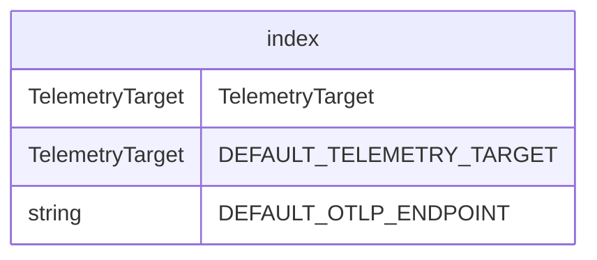

# Telemetry Index

此模块作为遥测系统的主入口点，导出遥测收集和报告所需的所有类型、常量和函数。

## 枚举

### TelemetryTarget
```ts
export enum TelemetryTarget {
  GCP = 'gcp',
  LOCAL = 'local',
}
```
指定遥测数据应发送到的位置：
- `GCP`: Google Cloud Platform
- `LOCAL`: 本地存储/调试

## 常量

### 默认值
```ts
const DEFAULT_TELEMETRY_TARGET = TelemetryTarget.LOCAL;
const DEFAULT_OTLP_ENDPOINT = 'http://localhost:4317';
```
遥测的默认配置值：
- 目标：本地存储
- OTLP 端点：端口 4317 的本地收集器

## 导出

### SDK 函数
用于管理遥测 SDK 生命周期的函数：
- `initializeTelemetry`: 初始化遥测系统
- `shutdownTelemetry`: 关闭遥测系统
- `isTelemetrySdkInitialized`: 检查遥测是否已初始化

### 日志记录函数
用于记录特定事件的函数：
- `logCliConfiguration`: 记录 CLI 配置更改
- `logUserPrompt`: 记录用户提示
- `logToolCall`: 记录工具调用
- `logApiRequest`: 记录 API 请求
- `logApiError`: 记录 API 错误
- `logApiResponse`: 记录 API 响应
- `logFlashFallback`: 记录 flash 模型回退事件
- `logSlashCommand`: 记录斜杠命令执行
- `logConversationFinishedEvent`: 记录对话完成
- `logKittySequenceOverflow`: 记录 kitty 序列溢出事件
- `logChatCompression`: 记录聊天历史压缩事件

### 事件类型
不同遥测事件的类：
- `SlashCommandStatus`: 斜杠命令状态
- `EndSessionEvent`: 会话终止事件
- `UserPromptEvent`: 用户提示事件
- `ApiRequestEvent`: API 请求事件
- `ApiErrorEvent`: API 错误事件
- `ApiResponseEvent`: API 响应事件
- `FlashFallbackEvent`: 模型回退事件
- `StartSessionEvent`: 会话开始事件
- `ToolCallEvent`: 工具调用事件
- `ConversationFinishedEvent`: 对话完成事件
- `KittySequenceOverflowEvent`: Kitty 序列溢出事件

### 事件创建函数
- `makeSlashCommandEvent`: 创建斜杠命令事件
- `makeChatCompressionEvent`: 创建聊天压缩事件

### 类型定义
- `SlashCommandEvent`: 斜杠命令事件类型
- `ChatCompressionEvent`: 聊天压缩事件类型
- `TelemetryEvent`: 所有遥测事件的基本类型

### OpenTelemetry 导出
从 OpenTelemetry 库重新导出：
- `SpanStatusCode`: 跨度状态码
- `ValueType`: 值类型
- `SemanticAttributes`: 语义属性定义

### UI 遥测
来自 UI 遥测模块的所有导出。

## 函数级调用关系

```mermaid
erDiagram
    index ||--|| TelemetryTarget : exports
    index ||--|| DEFAULT_TELEMETRY_TARGET : exports
    index ||--|| DEFAULT_OTLP_ENDPOINT : exports
    index ||--|| initializeTelemetry : exports
    index ||--|| shutdownTelemetry : exports
    index ||--|| isTelemetrySdkInitialized : exports
    index ||--|| logCliConfiguration : exports
    index ||--|| logUserPrompt : exports
    index ||--|| logToolCall : exports
    index ||--|| logApiRequest : exports
    index ||--|| logApiError : exports
    index ||--|| logApiResponse : exports
    index ||--|| logFlashFallback : exports
    index ||--|| logSlashCommand : exports
    index ||--|| logConversationFinishedEvent : exports
    index ||--|| logKittySequenceOverflow : exports
    index ||--|| logChatCompression : exports
    index ||--|| SlashCommandStatus : exports
    index ||--|| EndSessionEvent : exports
    index ||--|| UserPromptEvent : exports
    index ||--|| ApiRequestEvent : exports
    index ||--|| ApiErrorEvent : exports
    index ||--|| ApiResponseEvent : exports
    index ||--|| FlashFallbackEvent : exports
    index ||--|| StartSessionEvent : exports
    index ||--|| ToolCallEvent : exports
    index ||--|| ConversationFinishedEvent : exports
    index ||--|| KittySequenceOverflowEvent : exports
    index ||--|| makeSlashCommandEvent : exports
    index ||--|| makeChatCompressionEvent : exports
    index ||--|| SlashCommandEvent : exports
    index ||--|| ChatCompressionEvent : exports
    index ||--|| TelemetryEvent : exports
    index ||--|| SpanStatusCode : exports
    index ||--|| ValueType : exports
    index ||--|| SemanticAttributes : exports
```



## 变量级调用关系

