# 遥测日志记录器 (loggers.ts)

遥测日志记录器提供结构化的日志记录功能，将事件数据发送到遥测系统。

## 核心功能

1. **事件记录**：记录各种遥测事件
2. **指标收集**：收集和处理性能指标
3. **数据丰富**：添加上下文信息到日志
4. **条件记录**：根据配置决定是否记录敏感数据

## 核心函数

### logCliConfiguration()
记录 CLI 配置加载事件：
- 模型设置
- 沙箱配置
- 工具启用状态
- 认证方式
- 文件过滤设置

### logUserPrompt()
记录用户提示事件：
- 提示长度
- 提示ID
- 认证类型
- 提示内容（根据配置决定是否记录）

### logToolCall()
记录工具调用事件：
- 工具名称
- 调用参数（JSON序列化）
- 执行时间
- 成功状态
- 错误信息
- 工具类型

### logFileOperation()
记录文件操作事件：
- 工具名称
- 操作类型
- 行数
- MIME类型
- 文件扩展名
- 编程语言

### logApiRequest()
记录 API 请求事件：
- 模型名称
- 提示ID
- 请求文本

### logApiError()
记录 API 错误事件：
- 模型名称
- 错误信息
- 错误类型
- 状态码
- 执行时间
- 认证类型

### logApiResponse()
记录 API 响应事件：
- 模型名称
- 状态码
- 执行时间
- Token 使用统计
- 响应文本
- 错误信息

## 辅助函数

### getCommonAttributes()
获取通用日志属性：
- 会话ID
- 用户邮箱（如果可用）

### shouldLogUserPrompts()
检查是否应该记录用户提示：
- 根据配置决定是否记录提示内容

## 指标记录集成

### recordToolCallMetrics()
记录工具调用指标：
- 调用计数
- 执行时间分布
- 成功率
- 工具决策分布

### recordFileOperationMetric()
记录文件操作指标：
- 操作类型分布
- 文件类型统计
- 行数分布

### recordApiErrorMetrics()
记录 API 错误指标：
- 错误类型分布
- 状态码统计
- 模型错误率

### recordTokenUsageMetrics()
记录 Token 使用指标：
- 输入/输出 Token 消耗
- 缓存 Token 使用
- 思考 Token 消耗

### recordApiResponseMetrics()
记录 API 响应指标：
- 响应时间分布
- 成功率
- 状态码分布

## Clearcut 集成

所有主要事件都会同时发送到 Clearcut 日志系统：
- logStartSessionEvent()
- logNewPromptEvent()
- logToolCallEvent()
- logApiRequestEvent()
- logApiErrorEvent()
- logApiResponseEvent()

## UI 遥测集成

关键事件同时发送到 UI 遥测服务：
- 工具调用事件
- API 错误事件
- API 响应事件

## 数据安全

### 敏感数据处理
- 用户提示内容根据配置决定是否记录
- 错误消息进行适当的清理
- 参数数据进行安全的 JSON 序列化

### 数据验证
- 验证事件数据的完整性
- 处理缺失或无效的数据字段
- 提供默认值和错误处理

## 函数级调用关系

```mermaid
erDiagram
    loggers ||--|| logCliConfiguration : calls
    loggers ||--|| logUserPrompt : calls
    loggers ||--|| logToolCall : calls
    loggers ||--|| logFileOperation : calls
    loggers ||--|| logApiRequest : calls
    loggers ||--|| logApiError : calls
    loggers ||--|| logApiResponse : calls
    loggers ||--|| getCommonAttributes : calls
    loggers ||--|| shouldLogUserPrompts : calls
    loggers ||--|| recordToolCallMetrics : calls
    loggers ||--|| recordFileOperationMetric : calls
    loggers ||--|| recordApiErrorMetrics : calls
    loggers ||--|| recordTokenUsageMetrics : calls
    loggers ||--|| recordApiResponseMetrics : calls
    loggers ||--|| logStartSessionEvent : calls
    loggers ||--|| logNewPromptEvent : calls
    loggers ||--|| logToolCallEvent : calls
    loggers ||--|| logApiRequestEvent : calls
    loggers ||--|| logApiErrorEvent : calls
    loggers ||--|| logApiResponseEvent : calls
    logCliConfiguration ||--|| logger.info : calls
    logCliConfiguration ||--|| getCommonAttributes : calls
    logUserPrompt ||--|| logger.info : calls
    logUserPrompt ||--|| getCommonAttributes : calls
    logUserPrompt ||--|| shouldLogUserPrompts : calls
    logToolCall ||--|| logger.info : calls
    logToolCall ||--|| getCommonAttributes : calls
    logFileOperation ||--|| logger.info : calls
    logFileOperation ||--|| getCommonAttributes : calls
    logApiRequest ||--|| logger.info : calls
    logApiRequest ||--|| getCommonAttributes : calls
    logApiError ||--|| logger.error : calls
    logApiError ||--|| getCommonAttributes : calls
    logApiResponse ||--|| logger.info : calls
    logApiResponse ||--|| getCommonAttributes : calls
    recordToolCallMetrics ||--|| toolCallCounter.add : calls
    recordToolCallMetrics ||--|| toolCallTimeHistogram.record : calls
    recordFileOperationMetric ||--|| fileOperationCounter.add : calls
    recordApiErrorMetrics ||--|| apiErrorCounter.add : calls
    recordTokenUsageMetrics ||--|| tokenUsageCounter.add : calls
    recordApiResponseMetrics ||--|| apiResponseTimeHistogram.record : calls
    logStartSessionEvent ||--|| clearcutLogger.log : calls
    logNewPromptEvent ||--|| clearcutLogger.log : calls
    logToolCallEvent ||--|| clearcutLogger.log : calls
    logApiRequestEvent ||--|| clearcutLogger.log : calls
    logApiErrorEvent ||--|| clearcutLogger.log : calls
    logApiResponseEvent ||--|| clearcutLogger.log : calls
```



## 变量级调用关系

```mermaid
erDiagram
    loggers {
        // No module-level variables
    }
    logCliConfiguration {
        Config config
        object commonAttributes
        object configInfo
    }
    logUserPrompt {
        string prompt
        string promptId
        AuthType authType
        number promptLength
        object commonAttributes
        boolean shouldLogContent
    }
    logToolCall {
        string toolName
        object args
        number executionTimeMs
        boolean success
        string error
        string toolType
        object commonAttributes
    }
    logFileOperation {
        string toolName
        string operation
        number lineCount
        string mimeType
        string fileExtension
        string language
        object commonAttributes
    }
    logApiRequest {
        string model
        string promptId
        string requestText
        object commonAttributes
    }
    logApiError {
        string model
        string error
        string errorType
        number statusCode
        number executionTimeMs
        AuthType authType
        object commonAttributes
    }
    logApiResponse {
        string model
        number statusCode
        number executionTimeMs
        object tokenUsage
        string responseText
        string error
        object commonAttributes
    }
    getCommonAttributes {
        Config config
        object commonAttributes
    }
    shouldLogUserPrompts {
        Config config
        boolean logPrompts
    }
    recordToolCallMetrics {
        string toolName
        number executionTimeMs
        boolean success
        string toolType
    }
    recordFileOperationMetric {
        string operation
        string mimeType
        string fileExtension
        string language
        number lineCount
    }
    recordApiErrorMetrics {
        string model
        string errorType
        number statusCode
    }
    recordTokenUsageMetrics {
        object tokenUsage
        string model
    }
    recordApiResponseMetrics {
        number executionTimeMs
        number statusCode
        boolean success
        string model
    }
    logStartSessionEvent {
        object event
    }
    logNewPromptEvent {
        object event
    }
    logToolCallEvent {
        object event
    }
    logApiRequestEvent {
        object event
    }
    logApiErrorEvent {
        object event
    }
    logApiResponseEvent {
        object event
    }
```