# Telemetry Loggers

此模块使用 OpenTelemetry 和 Clearcut 日志系统提供记录 Gemini CLI 应用程序中各种事件的函数。

## 辅助函数

### shouldLogUserPrompts
```ts
const shouldLogUserPrompts = (config: Config): boolean
```
根据遥测配置确定是否应记录用户提示。

### getCommonAttributes
```ts
function getCommonAttributes(config: Config): LogAttributes
```
返回所有日志记录的通用属性，包括会话 ID 和用户邮箱（如果可用）。

## 事件日志记录函数

### logCliConfiguration
```ts
export function logCliConfiguration(config: Config, event: StartSessionEvent): void
```
记录 CLI 配置事件，包含详细的配置信息，包括模型设置、沙盒状态、核心工具、批准模式和 MCP 服务器配置。

### logUserPrompt
```ts
export function logUserPrompt(config: Config, event: UserPromptEvent): void
```
记录用户提示事件，根据配置设置有条件地包含实际提示文本。

### logToolCall
```ts
export function logToolCall(config: Config, event: ToolCallEvent): void
```
记录工具调用事件，包含有关工具执行的详细信息，包括成功状态、持续时间和错误详细信息。还记录工具调用指标。

### logFileOperation
```ts
export function logFileOperation(config: Config, event: FileOperationEvent): void
```
记录工具执行的文件操作事件，包含文件元数据信息。记录文件操作指标。

### logApiRequest
```ts
export function logApiRequest(config: Config, event: ApiRequestEvent): void
```
记录 API 请求事件，包含有关 AI 模型请求的信息。

### logFlashFallback
```ts
export function logFlashFallback(config: Config, event: FlashFallbackEvent): void
```
记录当切换到不同模型时的 flash 模型回退事件。

### logApiError
```ts
export function logApiError(config: Config, event: ApiErrorEvent): void
```
记录 API 错误事件，包含详细的错误信息，包括状态码和错误类型。记录 API 错误指标。

### logApiResponse
```ts
export function logApiResponse(config: Config, event: ApiResponseEvent): void
```
记录 API 响应事件，包含响应详细信息和状态信息。记录 API 响应指标和不同令牌类型（输入、输出、缓存、思考、工具）的令牌使用指标。

### logLoopDetected
```ts
export function logLoopDetected(config: Config, event: LoopDetectedEvent): void
```
记录在对话中检测到潜在无限循环时的循环检测事件。

### logNextSpeakerCheck
```ts
export function logNextSpeakerCheck(config: Config, event: NextSpeakerCheckEvent): void
```
记录对话流管理期间的下一位发言者检查事件。

### logSlashCommand
```ts
export function logSlashCommand(config: Config, event: SlashCommandEvent): void
```
记录斜杠命令执行事件。

### logIdeConnection
```ts
export function logIdeConnection(config: Config, event: IdeConnectionEvent): void
```
记录包含连接类型信息的 IDE 连接事件。

### logConversationFinishedEvent
```ts
export function logConversationFinishedEvent(config: Config, event: ConversationFinishedEvent): void
```
记录对话完成事件。

### logChatCompression
```ts
export function logChatCompression(config: Config, event: ChatCompressionEvent): void
```
记录聊天历史压缩事件，包括保存的令牌数量。记录聊天压缩指标。

### logKittySequenceOverflow
```ts
export function logKittySequenceOverflow(config: Config, event: KittySequenceOverflowEvent): void
```
记录当终端序列超过缓冲区限制时的 kitty 序列缓冲区溢出事件。

### logMalformedJsonResponse
```ts
export function logMalformedJsonResponse(config: Config, event: MalformedJsonResponseEvent): void
```
记录当 API 响应无法解析时的格式错误的 JSON 响应事件。

### logInvalidChunk
```ts
export function logInvalidChunk(config: Config, event: InvalidChunkEvent): void
```
记录接收格式错误数据时的无效块事件。记录无效块指标。

### logContentRetry
```ts
export function logContentRetry(config: Config, event: ContentRetryEvent): void
```
记录尝试从 API 错误中恢复时的内容重试事件。记录内容重试指标。

### logContentRetryFailure
```ts
export function logContentRetryFailure(config: Config, event: ContentRetryFailureEvent): void
```
记录当所有重试尝试都已用尽时的内容重试失败事件。记录内容重试失败指标。

## 集成

该模块与以下组件集成：
- OpenTelemetry 日志 API 用于结构化事件日志记录
- Clearcut 记录器用于 Google 特定的事件日志记录
- UI 遥测服务用于前端事件跟踪
- 指标记录函数用于定量分析
- 用户账户管理用于用户识别
- 安全的 JSON 字符串化用于序列化复杂对象

## 函数级调用关系

```mermaid
erDiagram
    loggers ||--|| shouldLogUserPrompts : calls
    loggers ||--|| getCommonAttributes : calls
    loggers ||--|| logCliConfiguration : calls
    loggers ||--|| logUserPrompt : calls
    loggers ||--|| logToolCall : calls
    loggers ||--|| logFileOperation : calls
    loggers ||--|| logApiRequest : calls
    loggers ||--|| logFlashFallback : calls
    loggers ||--|| logApiError : calls
    loggers ||--|| logApiResponse : calls
    loggers ||--|| logLoopDetected : calls
    loggers ||--|| logNextSpeakerCheck : calls
    loggers ||--|| logSlashCommand : calls
    loggers ||--|| logIdeConnection : calls
    loggers ||--|| logConversationFinishedEvent : calls
    loggers ||--|| logChatCompression : calls
    loggers ||--|| logKittySequenceOverflow : calls
    loggers ||--|| logMalformedJsonResponse : calls
    loggers ||--|| logInvalidChunk : calls
    loggers ||--|| logContentRetry : calls
    loggers ||--|| logContentRetryFailure : calls
    logCliConfiguration ||--|| logger.info : calls
    logCliConfiguration ||--|| getCommonAttributes : calls
    logUserPrompt ||--|| logger.info : calls
    logUserPrompt ||--|| getCommonAttributes : calls
    logUserPrompt ||--|| shouldLogUserPrompts : calls
    logToolCall ||--|| logger.info : calls
    logToolCall ||--|| getCommonAttributes : calls
    logToolCall ||--|| recordToolCallMetrics : calls
    logFileOperation ||--|| logger.info : calls
    logFileOperation ||--|| getCommonAttributes : calls
    logFileOperation ||--|| recordFileOperationMetric : calls
    logApiRequest ||--|| logger.info : calls
    logApiRequest ||--|| getCommonAttributes : calls
    logFlashFallback ||--|| logger.info : calls
    logFlashFallback ||--|| getCommonAttributes : calls
    logApiError ||--|| logger.error : calls
    logApiError ||--|| getCommonAttributes : calls
    logApiError ||--|| recordApiErrorMetrics : calls
    logApiResponse ||--|| logger.info : calls
    logApiResponse ||--|| getCommonAttributes : calls
    logApiResponse ||--|| recordApiResponseMetrics : calls
    logApiResponse ||--|| recordTokenUsageMetrics : calls
    logLoopDetected ||--|| logger.info : calls
    logLoopDetected ||--|| getCommonAttributes : calls
    logNextSpeakerCheck ||--|| logger.info : calls
    logNextSpeakerCheck ||--|| getCommonAttributes : calls
    logSlashCommand ||--|| logger.info : calls
    logSlashCommand ||--|| getCommonAttributes : calls
    logIdeConnection ||--|| logger.info : calls
    logIdeConnection ||--|| getCommonAttributes : calls
    logConversationFinishedEvent ||--|| logger.info : calls
    logConversationFinishedEvent ||--|| getCommonAttributes : calls
    logChatCompression ||--|| logger.info : calls
    logChatCompression ||--|| getCommonAttributes : calls
    logChatCompression ||--|| recordChatCompressionMetrics : calls
    logKittySequenceOverflow ||--|| logger.info : calls
    logKittySequenceOverflow ||--|| getCommonAttributes : calls
    logMalformedJsonResponse ||--|| logger.info : calls
    logMalformedJsonResponse ||--|| getCommonAttributes : calls
    logInvalidChunk ||--|| logger.info : calls
    logInvalidChunk ||--|| getCommonAttributes : calls
    logInvalidChunk ||--|| recordInvalidChunkMetrics : calls
    logContentRetry ||--|| logger.info : calls
    logContentRetry ||--|| getCommonAttributes : calls
    logContentRetry ||--|| recordContentRetryMetrics : calls
    logContentRetryFailure ||--|| logger.info : calls
    logContentRetryFailure ||--|| getCommonAttributes : calls
    logContentRetryFailure ||--|| recordContentRetryFailureMetrics : calls
```



## 变量级调用关系

```mermaid
erDiagram
    loggers {
        // No module-level variables
    }
    shouldLogUserPrompts {
        Config config
        boolean logPrompts
    }
    getCommonAttributes {
        Config config
        object commonAttributes
    }
    logCliConfiguration {
        Config config
        StartSessionEvent event
        object commonAttributes
        object configInfo
    }
    logUserPrompt {
        Config config
        UserPromptEvent event
        object commonAttributes
        boolean shouldLogContent
    }
    logToolCall {
        Config config
        ToolCallEvent event
        object commonAttributes
    }
    logFileOperation {
        Config config
        FileOperationEvent event
        object commonAttributes
    }
    logApiRequest {
        Config config
        ApiRequestEvent event
        object commonAttributes
    }
    logFlashFallback {
        Config config
        FlashFallbackEvent event
        object commonAttributes
    }
    logApiError {
        Config config
        ApiErrorEvent event
        object commonAttributes
    }
    logApiResponse {
        Config config
        ApiResponseEvent event
        object commonAttributes
    }
    logLoopDetected {
        Config config
        LoopDetectedEvent event
        object commonAttributes
    }
    logNextSpeakerCheck {
        Config config
        NextSpeakerCheckEvent event
        object commonAttributes
    }
    logSlashCommand {
        Config config
        SlashCommandEvent event
        object commonAttributes
    }
    logIdeConnection {
        Config config
        IdeConnectionEvent event
        object commonAttributes
    }
    logConversationFinishedEvent {
        Config config
        ConversationFinishedEvent event
        object commonAttributes
    }
    logChatCompression {
        Config config
        ChatCompressionEvent event
        object commonAttributes
    }
    logKittySequenceOverflow {
        Config config
        KittySequenceOverflowEvent event
        object commonAttributes
    }
    logMalformedJsonResponse {
        Config config
        MalformedJsonResponseEvent event
        object commonAttributes
    }
    logInvalidChunk {
        Config config
        InvalidChunkEvent event
        object commonAttributes
    }
    logContentRetry {
        Config config
        ContentRetryEvent event
        object commonAttributes
    }
    logContentRetryFailure {
        Config config
        ContentRetryFailureEvent event
        object commonAttributes
    }
```