# 遥测事件类型 (types.ts)

遥测事件类型定义了系统中所有可能的遥测事件结构。

## 基础类型

### BaseTelemetryEvent
所有遥测事件的基础接口：
- `event.name` - 事件名称
- `event.timestamp` - 事件时间戳

## 核心事件类型

### StartSessionEvent
会话开始事件，记录 CLI 配置信息：
- 模型设置
- 嵌入模型
- 沙箱配置
- 核心工具状态
- 审批模式
- 认证设置
- 调试模式
- MCP 服务器和工具信息

### EndSessionEvent
会话结束事件：
- 会话ID

### UserPromptEvent
用户提示事件：
- 提示长度
- 提示ID
- 认证类型
- 提示内容（可选）

### ToolCallEvent
工具调用事件：
- 工具名称
- 调用参数
- 执行时间
- 成功状态
- 调用决策
- 错误信息
- 工具类型
- 元数据（如文件差异统计）

### ApiRequestEvent
API 请求事件：
- 模型名称
- 提示ID
- 请求文本

### ApiErrorEvent
API 错误事件：
- 模型名称
- 错误信息
- 错误类型
- 状态码
- 执行时间
- 提示ID
- 认证类型

### ApiResponseEvent
API 响应事件：
- 模型名称
- 状态码
- 执行时间
- 错误信息
- Token 使用统计
- 响应文本
- 提示ID
- 认证类型

### FlashFallbackEvent
Flash 降级事件：
- 认证类型

## 特殊事件类型

### LoopDetectedEvent
循环检测事件：
- 循环类型（连续相同工具调用、重复句子、LLM检测到的循环）
- 提示ID

### NextSpeakerCheckEvent
下一位发言者检查事件：
- 提示ID
- 结束原因
- 检查结果

### SlashCommandEvent
斜杠命令事件：
- 命令名称
- 子命令
- 执行状态

### ChatCompressionEvent
聊天压缩事件：
- 压缩前 Token 数量
- 压缩后 Token 数量

### FileOperationEvent
文件操作事件：
- 工具名称
- 操作类型
- 行数
- MIME 类型
- 文件扩展名
- 编程语言

## IDE 相关事件

### IdeConnectionEvent
IDE 连接事件：
- 连接类型（启动、会话）

## 会话结束事件

### ConversationFinishedEvent
对话完成事件：
- 审批模式
- 对话轮次计数

## 错误处理事件

### KittySequenceOverflowEvent
Kitty 序列溢出事件：
- 序列长度
- 截断序列（前20个字符）

### MalformedJsonResponseEvent
格式错误的 JSON 响应事件：
- 模型名称

### InvalidChunkEvent
无效数据块事件：
- 错误消息

### ContentRetryEvent
内容重试事件：
- 尝试次数
- 错误类型
- 重试延迟

### ContentRetryFailureEvent
内容重试失败事件：
- 总尝试次数
- 最终错误类型
- 总耗时

## 枚举类型

### LoopType
循环类型枚举：
- `CONSECUTIVE_IDENTICAL_TOOL_CALLS` - 连续相同工具调用
- `CHANTING_IDENTICAL_SENTENCES` - 重复相同句子
- `LLM_DETECTED_LOOP` - LLM 检测到的循环

### SlashCommandStatus
斜杠命令状态枚举：
- `SUCCESS` - 成功
- `ERROR` - 错误

### IdeConnectionType
IDE 连接类型枚举：
- `START` - 启动连接
- `SESSION` - 会话连接

## 工具函数

### makeSlashCommandEvent()
创建斜杠命令事件的工厂函数

### makeChatCompressionEvent()
创建聊天压缩事件的工厂函数

## 函数级调用关系

```mermaid
erDiagram
    types ||--|| makeSlashCommandEvent : exports
    types ||--|| makeChatCompressionEvent : exports
    types ||--|| BaseTelemetryEvent : exports
    types ||--|| StartSessionEvent : exports
    types ||--|| EndSessionEvent : exports
    types ||--|| UserPromptEvent : exports
    types ||--|| ToolCallEvent : exports
    types ||--|| ApiRequestEvent : exports
    types ||--|| ApiErrorEvent : exports
    types ||--|| ApiResponseEvent : exports
    types ||--|| FlashFallbackEvent : exports
    types ||--|| LoopDetectedEvent : exports
    types ||--|| NextSpeakerCheckEvent : exports
    types ||--|| SlashCommandEvent : exports
    types ||--|| ChatCompressionEvent : exports
    types ||--|| FileOperationEvent : exports
    types ||--|| IdeConnectionEvent : exports
    types ||--|| ConversationFinishedEvent : exports
    types ||--|| KittySequenceOverflowEvent : exports
    types ||--|| MalformedJsonResponseEvent : exports
    types ||--|| InvalidChunkEvent : exports
    types ||--|| ContentRetryEvent : exports
    types ||--|| ContentRetryFailureEvent : exports
    types ||--|| LoopType : exports
    types ||--|| SlashCommandStatus : exports
    types ||--|| IdeConnectionType : exports
```



## 变量级调用关系

```mermaid
erDiagram
    types {
        // No module-level variables, only type definitions and functions
    }
    makeSlashCommandEvent {
        string command
        string subcommand
        SlashCommandStatus status
    }
    makeChatCompressionEvent {
        number originalTokenCount
        number newTokenCount
    }
```