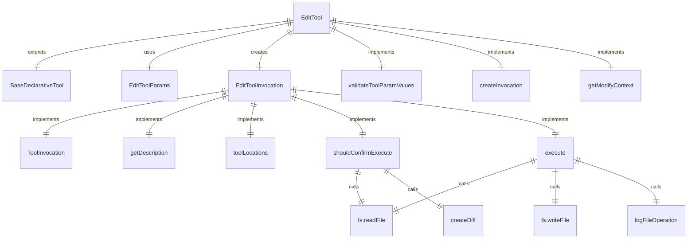

# EditTool 类

EditTool 是一个用于替换文件内容的工具实现。

## 主要功能

1. **文本替换**：在文件中替换指定文本
2. **文件创建**：创建新文件
3. **参数验证**：验证替换参数的有效性
4. **确认机制**：在执行前显示更改差异供用户确认
5. **遥测记录**：记录编辑操作的遥测数据

## 核心组件

### EditToolParams 接口
定义工具参数：
- `file_path` - 文件的绝对路径（必需）
- `old_string` - 要替换的文本（必需）
- `new_string` - 替换后的文本（必需）
- `expected_replacements` - 期望替换次数（可选）
- `modified_by_user` - 是否被用户修改（可选）
- `ai_proposed_content` - AI建议的内容（可选）

### EditTool 类
继承自 `BaseDeclarativeTool`，实现文件编辑功能：
- `Name` - 工具名称：'replace'
- `validateToolParamValues()` - 验证参数值
- `createInvocation()` - 创建工具调用实例
- `getModifyContext()` - 获取修改上下文

### EditToolInvocation 类
实现具体的文件编辑逻辑：
- `getDescription()` - 获取编辑描述
- `toolLocations()` - 获取工具位置
- `shouldConfirmExecute()` - 确定是否需要确认执行
- `execute()` - 执行文件编辑

## 特殊功能

### 精确替换
工具要求提供精确的文本匹配，包括所有空白、缩进和换行符：
- 必须包含足够的上下文（目标文本前后至少3行）
- 必须完全匹配文件中的内容
- 支持单次和多次替换

### 差异显示
在执行前显示更改的差异：
- 使用标准diff格式显示更改
- 在CLI和IDE中提供差异确认
- 支持用户修改建议的内容

### 错误处理
多种错误情况的处理：
- 文件未找到
- 文本未找到
- 替换次数不匹配
- 尝试创建已存在的文件
- 内容无变化

### 遥测集成
记录编辑操作的详细信息：
- 文件扩展名
- MIME类型
- 编程语言
- 操作类型（创建或更新）
- 差异统计信息

## 函数级调用关系

## 变量级调用关系

```mermaid
erDiagram
    EditTool {
        string Name
    }
    EditToolParams {
        string file_path
        string old_string
        string new_string
        number expected_replacements
        boolean modified_by_user
        string ai_proposed_content
    }
    EditToolInvocation {
        EditToolParams args
        Config config
    }
    validateToolParamValues {
        EditToolParams params
        object errors
    }
    createInvocation {
        EditToolParams args
        Config config
        EditToolInvocation invocation
    }
    getModifyContext {
        EditToolParams params
        object context
    }
    getDescription {
        string description
    }
    toolLocations {
        string[] locations
    }
    shouldConfirmExecute {
        boolean shouldConfirm
        string diff
    }
    execute {
        string fileContent
        string newFileContent
        number replacements
        DiffStat diffStat
    }
```

