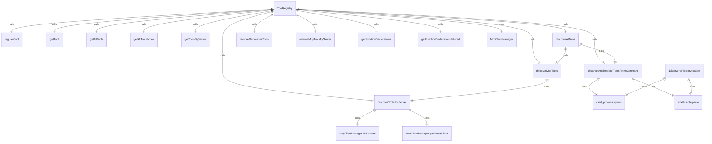

# 工具注册表

此模块管理 iFlow CLI 应用程序中的工具注册、发现和执行，支持内置工具和从外部源动态发现的工具。

## 核心类

### DiscoveredToolInvocation
为通过命令执行发现的工具实现 ToolInvocation：
- 通过使用配置的工具调用命令生成子进程来执行工具
- 通过 stdin 以 JSON 格式传递参数
- 捕获 stdout、stderr、退出码和信号
- 当工具执行失败时返回全面的错误信息
- 处理进程生命周期管理和清理

### DiscoveredTool
为通过命令执行发现的工具扩展 BaseDeclarativeTool：
- 自动生成详细描述，包括发现和执行命令
- 将发现的工具注册到 Kind.Other 类别
- 创建 DiscoveredToolInvocation 实例用于执行

### ToolRegistry
用于管理应用程序中所有工具的主类：

#### 工具管理
- `registerTool()`: 注册工具定义，处理重复和覆盖
- `getTool()`: 按名称检索特定工具
- `getAllTools()`: 返回所有已注册的工具
- `getAllToolNames()`: 返回所有已注册工具的名称
- `getToolsByServer()`: 返回从特定 MCP 服务器注册的工具

#### 工具发现
- `discoverAllTools()`: 从命令行和 MCP 服务器发现工具
- `discoverMcpTools()`: 仅从 MCP 服务器发现工具
- `discoverToolsForServer()`: 为单个 MCP 服务器发现工具
- `discoverAndRegisterToolsFromCommand()`: 用于基于命令的工具发现的内部方法
- `removeDiscoveredTools()`: 移除先前发现的工具
- `removeMcpToolsByServer()`: 移除特定 MCP 服务器的所有工具

#### 模式管理
- `getFunctionDeclarations()`: 将所有工具模式作为 FunctionDeclaration 数组检索
- `getFunctionDeclarationsFiltered()`: 按名称检索过滤后的工具模式

#### MCP 集成
- 与 McpClientManager 集成用于 MCP 服务器通信
- 支持从模型调用协议服务器动态发现工具
- 管理 MCP 服务器的工具生命周期，包括重启

## 主要功能

### 动态工具发现
- 支持通过外部命令发现工具
- 解析发现命令的 JSON 输出
- 处理多种工具声明格式
- 对发现命令输出强制执行大小限制
- 为失败的发现提供详细的错误报告

### MCP 服务器集成
- 管理与多个 MCP 服务器的连接
- 支持从 MCP 服务器动态注册工具
- 处理服务器重启和重新发现
- 提供服务器特定的工具过滤

### 进程管理
- 安全地将外部工具命令作为子进程执行
- 实现适当的资源清理和信号处理
- 捕获全面的执行元数据
- 处理进程错误、退出码和信号

### 错误处理
- 为工具执行失败提供全面的错误报告
- 对工具输出强制执行大小限制
- 优雅地处理格式错误的发现输出
- 在工具结果中提供详细的错误信息

## 依赖项
- Node.js child_process 用于子进程执行
- shell-quote 用于命令解析
- MCP 客户端模块用于服务器通信
- 安全 JSON 字符串化工具
- 配置管理

## 函数级调用关系

## 变量级调用关系

```mermaid
erDiagram
    ToolRegistry {
        Map tools
        McpClientManager mcpClientManager
    }
    registerTool {
        ToolDefinition tool
        string name
    }
    getTool {
        string name
        ToolDefinition tool
    }
    getAllTools {
        ToolDefinition[] tools
    }
    getAllToolNames {
        string[] toolNames
    }
    getToolsByServer {
        string serverName
        ToolDefinition[] tools
    }
    discoverAllTools {
        Config config
        string[] discoveryCommands
    }
    discoverMcpTools {
        Config config
    }
    discoverToolsForServer {
        string serverName
        McpClient client
        ListToolsResult tools
    }
    discoverAndRegisterToolsFromCommand {
        string command
        ChildProcess child
        string stdout
        string stderr
    }
    removeDiscoveredTools {
        string[] removedTools
    }
    removeMcpToolsByServer {
        string serverName
        string[] removedTools
    }
    getFunctionDeclarations {
        ToolDefinition[] tools
        FunctionDeclaration[] declarations
    }
    getFunctionDeclarationsFiltered {
        string[] toolNames
        ToolDefinition[] tools
        FunctionDeclaration[] declarations
    }
    DiscoveredToolInvocation {
        DiscoveredToolParams args
        string command
        string[] parsedCommand
        ChildProcess child
    }
```

