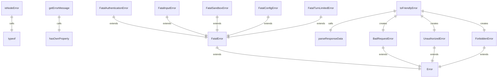

# 错误处理工具

错误处理工具提供了一系列处理和转换错误的实用函数。

## 核心函数

### 类型检查
- `isNodeError()` - 检查错误是否为 Node.js 错误类型

### 错误信息提取
- `getErrorMessage()` - 安全地获取错误消息字符串

### 错误转换
- `toFriendlyError()` - 将原始错误转换为用户友好的错误类型

## 自定义错误类

### FatalError
致命错误基类，包含退出码：
- `exitCode` - 进程退出码

### 特定致命错误
- `FatalAuthenticationError` - 认证错误（退出码41）
- `FatalInputError` - 输入错误（退出码42）
- `FatalSandboxError` - 沙箱错误（退出码44）
- `FatalConfigError` - 配置错误（退出码52）
- `FatalTurnLimitedError` - 轮次限制错误（退出码53）

### 业务逻辑错误
- `ForbiddenError` - 禁止访问错误
- `UnauthorizedError` - 未授权错误
- `BadRequestError` - 错误请求错误

## 功能详解

### 错误类型检查 (isNodeError)
检查未知错误是否为 Node.js 系统错误：
- 验证错误对象具有 'code' 属性
- 用于安全地访问 Node.js 特定错误属性

### 错误消息提取 (getErrorMessage)
安全地从任意错误对象中提取消息：
- 处理 Error 实例
- 处理字符串和其他类型
- 提供失败时的默认消息

### 友好错误转换 (toFriendlyError)
将 Gaxios 等 HTTP 客户端错误转换为特定错误类型：
- 400 错误转换为 BadRequestError
- 401 错误转换为 UnauthorizedError
- 403 错误转换为 ForbiddenError
- 保持原始错误消息以提供详细信息

### 响应数据解析 (parseResponseData)
解析 HTTP 响应数据：
- 处理字符串格式的 JSON 响应
- 兼容不同格式的响应数据
- 提取错误代码和消息

## 函数级调用关系



## 变量级调用关系

```mermaid
erDiagram
    isNodeError {
        unknown error
        boolean isNodeErrorResult
    }
    getErrorMessage {
        unknown error
        string message
    }
    toFriendlyError {
        unknown error
        Error friendlyError
    }
    parseResponseData {
        unknown data
        object parsedData
    }
    FatalError {
        number exitCode
    }
    FatalAuthenticationError {
        number exitCode = 41
    }
    FatalInputError {
        number exitCode = 42
    }
    FatalSandboxError {
        number exitCode = 44
    }
    FatalConfigError {
        number exitCode = 52
    }
    FatalTurnLimitedError {
        number exitCode = 53
    }
```
