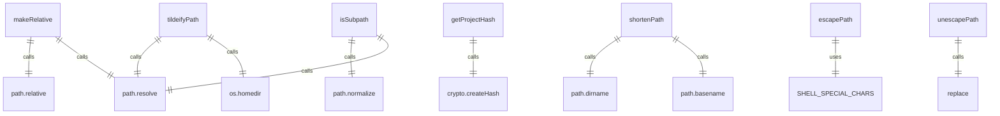

# 路径处理工具

路径处理工具提供了一系列处理文件路径的实用函数。

## 核心函数

### 路径转换
- `tildeifyPath()` - 将主目录路径替换为波浪号(~)
- `makeRelative()` - 计算相对于根目录的相对路径
- `getProjectHash()` - 基于项目根路径生成唯一哈希

### 路径显示
- `shortenPath()` - 缩短过长的路径显示
- `escapePath()` - 转义路径中的特殊字符
- `unescapePath()` - 取消转义路径中的特殊字符

### 路径验证
- `isSubpath()` - 检查路径是否为另一个路径的子路径

## 常量

### GEMINI_DIR
Gemini 配置目录名称：'.gemini'

### GOOGLE_ACCOUNTS_FILENAME
Google 账户信息文件名：'google_accounts.json'

### SHELL_SPECIAL_CHARS
需要转义的 shell 特殊字符正则表达式

## 功能详解

### 路径缩短 (shortenPath)
当路径超过指定长度时，优先保留开始和结束部分：
- 保持根目录和第一个目录
- 优先保留文件名和最后几个目录
- 在中间添加省略号(...)

### 相对路径计算 (makeRelative)
计算目标路径相对于根目录的相对路径：
- 确保两个路径都已解析
- 处理相同路径的情况（返回'.'）
- 返回标准相对路径格式

### 特殊字符转义 (escapePath)
转义 shell 中的特殊字符：
- 空格、括号、分号等
- 处理已转义字符避免重复转义
- 支持多种 shell 元字符

### 项目哈希 (getProjectHash)
基于项目根路径生成 SHA256 哈希：
- 用于唯一标识项目
- 在遥测和缓存中使用
- 确保路径隐私安全

### 子路径检查 (isSubpath)
检查子路径是否在父路径内：
- 跨平台兼容（Windows 和 POSIX）
- 处理相对路径和绝对路径
- 支持路径规范化

## 函数级调用关系



## 变量级调用关系

```mermaid
erDiagram
    tildeifyPath {
        string fullPath
        string homeDir
        string tildeifiedPath
    }
    makeRelative {
        string root
        string target
        string relativePath
    }
    getProjectHash {
        string projectRoot
        string hash
    }
    shortenPath {
        string p
        number maxLength
        string shortenedPath
    }
    escapePath {
        string p
        string escapedPath
    }
    unescapePath {
        string p
        string unescapedPath
    }
    isSubpath {
        string parent
        string child
        boolean isSubpathResult
    }
    GEMINI_DIR {
        string value = '.gemini'
    }
    GOOGLE_ACCOUNTS_FILENAME {
        string value = 'google_accounts.json'
    }
    SHELL_SPECIAL_CHARS {
        RegExp pattern
    }
```
