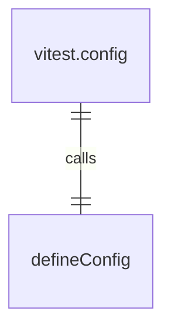
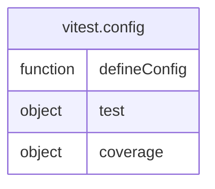

# vitest.config.ts

这个文件是core包Vitest测试框架的配置文件。

## 功能概述

1. 配置Vitest测试环境
2. 设置测试报告和覆盖率

## 配置结构

### 测试配置
- `reporters`: 设置测试报告器
- `silent`: 静默模式
- `setupFiles`: 设置测试环境设置文件
- `outputFile`: 设置JUnit报告输出文件

### 覆盖率配置
- `enabled`: 启用覆盖率
- `provider`: 设置覆盖率提供者为v8
- `reportsDirectory`: 设置覆盖率报告目录
- `include`: 定义覆盖率包含的文件
- `reporter`: 设置覆盖率报告器

## 依赖关系

- 依赖 `vitest/config` 中的 `defineConfig`

## 函数级调用关系

## 变量级调用关系

